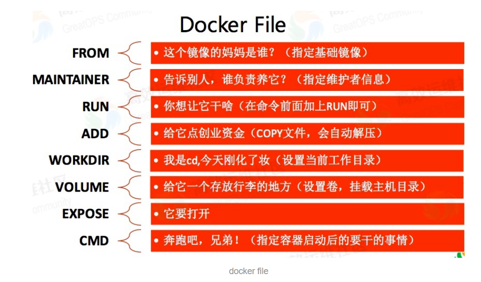

# Docker学习笔记

[TOC]

## 1.Docker概述

### 1.Docker为什么会出现？

开发运维环境不一致，导致出现问题。

Docker核心思想：环境相互隔离，不会互相影响

Docker镜像的设计，使得Docker得以打破过去【程序即应用】的观念。透过镜像(images)将作业系统核心除外，运作应用程式所需要的系统环境，由下而上打包，达到应用程式跨平台间的无缝接轨运作。

百度百科：Docker 是一个开源的应用容器引擎，让开发者可以打包他们的应用以及依赖包到一个可移植的镜像中，然后发布到任何流行的 Linux或Windows 机器上，也可以实现虚拟化。容器是完全使用沙箱机制，相互之间不会有任何接口。

官网：https://www.docker.com/

文档：https://docs.docker.com/

### 2.Docker能干嘛？

比较Docker与传统虚拟机的不同

- 传统虚拟机，虚拟出一套硬件，运行一个完整的操作系统，然后在这个系统上安装和运行软件
- 容器内的应用直接运行在宿主机的内核中容器是没有自己的内核的，也没有虚拟硬件，所以就轻便了。
- 每个容器是相互隔离的，每个容器都有一个属于自己的文件系统，互不影响 

### 3.Docker的好处

1. 应用更快速的交付和部署
2. 更便捷的升级和扩容
3. 更简单的系统运维
4. 更高效的计算资源利用

## 2.Docker安装

### 1.Docker组成

![img](data:image/jpeg;base64,/9j/4AAQSkZJRgABAQEASABIAAD/2wBDAAgGBgcGBQgHBwcJCQgKDBQNDAsLDBkSEw8UHRofHh0aHBwgJC4nICIsIxwcKDcpLDAxNDQ0Hyc5PTgyPC4zNDL/2wBDAQkJCQwLDBgNDRgyIRwhMjIyMjIyMjIyMjIyMjIyMjIyMjIyMjIyMjIyMjIyMjIyMjIyMjIyMjIyMjIyMjIyMjL/wAARCAEsAjcDASIAAhEBAxEB/8QAHAABAAMAAwEBAAAAAAAAAAAAAAQFBgIDBwEI/8QAUBAAAQMCAgMHEAkDBAEEAQUAAQACAwQFBhESITETFUFRYXSxFBYiMjM1NlJUVXFykZTR0gdWc4GSk6GysyNCU3WiwcMkNENEYiVjgoPC8P/EABsBAQACAwEBAAAAAAAAAAAAAAAEBQECAwYH/8QAMxEAAgECAggFAwQDAQEAAAAAAAECAxEEUQUSExQhMTJxM0FSYYEVIpEGodHwQrHhI8H/2gAMAwEAAhEDEQA/APf0RfNNvjD2oD6i+abfGHtTTb4w9qA+ovmm3xh7UBB2EFAfUREAREQBERAEREAREQBERAERfCQNpAQH1F802+MPamm3xh7UB9RfNNvjD2ppt8Ye1AfUXzTb4w9qabfGHtQH1F802+MPamm3xh7UB9RfA5p2OHtX1AEREAREQBERAEREAREQBERAEREAREQBERAEREAREQBF8Lmja4e1NNvjD2oD6i+abfGHtTTb4w9qA+ovmm3xh7U0mn+4e1AfUREAREQBEXRW1tNb6V9VVzNhgZ2z3HUEB3qqxHeDYbHUXFsImMWXYF2jnmQNq82x/jCSS50e8F4k3ERHdep5CBnnwrG1WILvW0ZgqrnUzRO7Zj5SQcjq1KRTw7kkyur6QhTbgk7nsGEMbSYnrainfRNp9yjD9Jshdnry4gtgvFfo0vFDabtWyXGrjp2vhAaXnac17HR1tNcKVlVSTNmgf2r2nUVpWgozaXI7YOrKpRUpvid6Lzy3Y1qYsVVMVwmaLfLO6JmlkNwLcwDnxHLX6VuKO6UFwz6jrIJ8tojkDsvYsTpyhbW8+J1o4inWTcHybXyiWiIuZ2KDFU9QIKChp5nwGvq2075WHJzWZFzsuIkNy+9VdysmF7U6CGS2z1NVPnucMRfJI/LaduzlKsMUODa/DpcQBvm0a/s3rjdqetpMSUd6paN9bEymfTTQxuAe3NwcHNzIB2ZELe7SVjjqRlN6yuU8NNg2ZjC23TCRwkzhc2QPaY8tJpGe3WFcDCeGS8M6jiDy3S0DK7Sy9Gapbtar/emmpkomQudDVMjiDgHMDg0MDjnrccj6FAGFLvvxLJKyd8pnfK2paYw3QLMg0u7bk0dixryzNtlT9K/BoauwYQoaSWqnggbDDlpuEzjo57NhXVcLZTYcdRXOzl8LXVEcUsIkLo5WPOWwnaM881T1mCp96GU9PbYi42psUrM2/wBSdr2nXntOQdrV3jAaOFKVjGmlcainDGDLNh0hqHBqW0JSckmznVhCEHJK1jXosPuVy8+13+z4JuVy8+13+z4Lru0szh9Qp5M3CLD7lcvPtd/s+CblcvPtd/s+CbtLMfUKeTNwiw+5XLz7Xf7Pgm5XLz7Xf7Pgm7SzH1CnkzcIsPuVy8+13+z4JuVy8+13+z4Ju0sx9Qp5M3CLD7lcvPtd/s+CblcvPtd/s+CbtLMfUKeTNwiy2GqitN4rqSprpqqNkMb2brlmCSc9g5FqVwnFxdmS6VRVIKSC85dNQ18rK28UtbcaitqaiOmpoCS2KOIkHJoI16s89q9GXnVsir9zs9wt9Ea0UdXXtljbK1hBe9wG1E2k2jE0pSSfLj/8EpwaIY5aa01FWw0/VMhgDiYY8yM3guGWsHVt1FSt78LS3AUdFZp61zWMfLJA4lkTX625kuHBryGvJRKLD16sMVYYaIVs1zozHJoSANgmL5Ha89rP6p1jxVZ2G1XDCtTLSso311LUtgymje0GNzY2sdpAkauxBGSa8szOyp+lfgjQUeD6mVkUNue+RzpQWguzYIyQ5zteoZjIca6IosLPskl4dh6sjo2xiVj35/1ATkNEaXKuyyYautjr6qqjibKy4yztqY3PGcYL3GN7TxZHW3lzUaiw5cuseeym21UFU6njjMklWHsc4OGeiMzo8J4E15ZjZU/SvwWlpsuGLs6pjZaJYJ6ZwbLDOXNc3MZjhyIIXdNh7C8F0ht77d/WmifM3J7stFuWfDyr5aIKjCrrhFU09TWQSziSGpjaZZXgjtX8PY5ZA8WS41lt65r7Q1zqerhpIKeaN2mXQP0zo5agQSNRTXlmNlT9K/BUbrgx0DZ4bPUzRCETzPZpEQRkkAu7LkOoZnIKdDbcM1V0loqSyT1Ahc1ss8bjoMLm6QGt2Z1EbBwqrtuG75ZbNV0MdB1Q64UTKcndW5QPGk3N2Z1jJ2erNW0tmrae70DrZQVFPUwGKOetErRFUQtADg9ueZOWoas+VNeWY2VP0oi0tFYrhdJrZT2G6UVVFo6VQHFu46QJa7PT5FqMK189xw/BNVP052OfE9+WWmWOLc/vyXygoKiDE94rpGgQVLIBG7Pbogg9Kxlgir3W17oLxVU8TqmYtjjDdEDdHbMwukIyqJq5wrVIYeSduDvy+D05Fhdxuvn+u9jPgm43Xz/XexnwW+7SzOf1CnkzdIsLuN18/wBd7GfBNxuvn+u9jPgm7SzH1CnkzdIsLuN18/13sZ8E3G6+f672M+CbtLMfUKeTN0iwu43Xz/XexnwTcbr5/rvYz4Ju0sx9Qp5M3SLC7jdfP9d7GfBNxuvn+u9jPgm7SzH1CnkzdIsLuN18/wBd7GfBNxuvn+u9jPgm7SzH1CnkzdIsLuN18/13sZ8E3G6+f672M+CbtLMfUKeTN0iwu43Xz/XexnwTcbr5/rvYz4Ju0sx9Qp5M3SLC7jdfP9d7GfBNxuvn+u9jPgm7SzH1CnkzdIsHJFdWxucL/XZgE7GfBajDdTNWYat1TUSGSaWna57zwkjaudSk4K7O1HExrNqKLRUmK6yoo7E80shimlljgEg2s03BpI5cirtZnHc0dPhxs0rtGOOqgc48QEgWkOpHWq7QbK662SwWg0cUlqqbhU1chjZlMS9zg0uJJc4DYCuFHQ4QqIKl9TQChdTSiGZlVKWlriARrDiDmDwK3vNqo8RTWqd08ElLTzGZzdPtwWEDIg8qoqnA+jUF9FVQMgjqnTw05mc0AOYGuBcMznmMxt2prSzGyp5IsJ7LgumbG6fqOMSt0mF1QRpDjHZbF1m1YNiEhqIaena2UxgyVBAcQAcx2XKs7crBVWqkq7dRwR1JraJsJJjdI1rs3HJjiTl2392XGrSowbUyRufHU0e7Okke1zpHNdGHMa3aMwe11gjIpryzGyp5Ilx0GB31VXT6NM19KWiUunIA0hmNealsw3hSpp2S07Yg2R+5xyw1DgdPiBB2qF1pTPfoz1dFLE6SllkcW5FzogARlsyOWa7aa3RjGVXVkiG1U/8AXa14DWmoLdFzm8gaPaSmvLMbKnki3wpVVE9rmhqZnTSUlTLTbq7tnhjsgTy5K9Xl9rt8FwNfW7tVCOorZpIzHUPY1zS7UcgVYbyU/lFf75J8VIeHb43ICx6itW17HoCLz/eSn8or/fJPim8lP5RX++SfFN2eZn6ivSbuepgpWtdPNHEHODWl7gMyeBeZ40xc640tysbKRjGtk3Pd3S7ciDnlkpFVhW11oaKoVM4brG6VL3Ze0rD4ksUVnu2iyJxpZhpR6RLtfCM11o4eKn9/8EbF46pKm1TVv34Fa21VIOelHlt7ddbbbM+QhssRc06wH7FIZThzcxDJuY7YhhyAXx1NBG87mwDlVmoQbsv9/wDDzrnUiry4fH/TqloJt0DDJEHOGoGTWt7YcZ1VhsEFvFBFI6EH+o6bIHMk7MuVYN8UGek5jS70a1xZA+smZTwQmSR5yaxvCtalCnJfev3OuHxVenL/AMnxft/01FHRVeK7vVdT9TM3QmokJJEbMzwbdp/5W8wbhOltUj7iayKsqSDGHw9owZ6wOM5hZm2YGttPQsbVNkfUOGchjlc0Z8WQOwK0w/aaWx4toILfusUM0Mxkj3VxaSAMjkSoOIlOUbJ2ivIucFClTqKUo3m3z7+3I9EREVaX5ksd0kdbDaIJC5rXVwIcw5OaRG8gg8eagNivjGhrcRVOQ2aUMZPtyVti/ull59/1vUdTqMU4cUU+LnKNZ6rtyIWhffrFP7vH8E0L79Yp/d4/greO31EjA4N1HjXPeyp8Ue1Z1qPsaqGKef5KXQvv1in93j+C4b3VFRVRVFyuU9aYTpRMe1rWNPHkNpV7vZU+KPam9lT4o9qKdJcUYdLEyVnf8kJFN3sqfFHtTeyp8Ue1bbaGZputb0kJFN3sqfFHtTeyp8Ue1NtDMbrW9JCRTd7KnxR7U3sqfFHtTbQzG61vSQkU3eup8Ue1N7KnxR7U20Mxutb0kJFLdbahrSS3YohGRyK2jOMuTNJ0p0+pWOeHfCa482i6XLVrKYd8JrjzaLpctWoVfxGW+D8Ff3zC8xstFVxQ1E9vulRRmapmMjGta9rjujhnkdhXpy8/sfe9/OJv5HLfDJO6Zwx8nHVaeZ26F9+sU/u8fwTQvv1in93j+CkzzxU0D5pnhkTBm5x2AKu65rL5xh/VStnHIr9vU9T/ACSNC+/WKf3eP4JoX36xT+7x/BR+uay+cYf1TrmsvnGH9U2ccht6nqf5JGjffrFP7vH8E0b79Yp/d4/go/XNZfOMP6p1zWXzjD+qbOOQ29T1P8kjQvv1in93j+CaF9+sU/u8fwUfrmsvnGH9U65rL5xh/VNnHIbep6n+TtlprxUxmKfENU6Jwyc1kbGEjizAzCl01NFSU0dPAwMijbotaOAKv65rL5xh/VOuay+cYf1WVFLkjSU3Lqdy1RVXXNZfOMP6p1zWXzjD+qya3LVFVdc1l84w/qnXNZfOMP6oLlqiquuay+cYf1TrmsvnGH9UFy1RVXXNZfOMP6p1zWXzjD+qC5aoqrrmsvnGH9U65rL5xh/VBctUVV1zWXzjD+qdc1l84w/qguWqKq65rL5xh/VOuay+cYf1QXLVFVdc1l84w/qnXNZfOMP6oLlqiquuay+cYf1Uyjr6S4ROkpJ2TMadElvAeJAd03cJPVPQrjCXgjaebM6FTzdwk9U9CuMJeCNp5szoUfE9KLDR/W+xcrN45aHYea1wBBqoQQeHswtIs3jfwfZzqD94UWn1osMR4UuzKB2G7QXE9QsGfA1xA9gK+dbVo8jH43fFWyKyKAqetq0eRj8bvinW1aPIx+N3xVsiAqetq0eRj8bvivow1Zwc+omHkLnEezNWqIDixjY2BjGhrWjIADIBckRAEREAXRVUkVZEGSg5g5tcNRaeMFd6JzCduKK1wuEULoJIoqyFw0Tk7QcRyjYVi6zCdyfUuNHSvbCdglkb2PsXoyJTvTf2sVbVktdXsef0mA62RwNZUxQt4RH2TvgtdarHQ2ePRpouzPbSu1ud96skW0pSlzZpGEYdKsFHpfDS1fYT9DVIUel8NLV9hP0NXKp0MkUPFj3NsiIq09AZnF/dLLz7/reulnbt9K7sX90svPv+t66GnJwPEp1HwymxbtiOPsaiMZRt9AXGeZlPTyTSHJkbS9x5AMyuqGshdE0l4By2FfZJqaWJ8cj2OY8FrgeEFQbFwmnyMHU4vr4blQ3epp2xW+S3zTw08cxLpAXMDC8ZZA6xx5ZlW0+L6u2dVU9yoIhWxxxPhZBKSyTdHaDQSRqydtXZT4Ow3TgjRklG4OpwJp3P0YnZdgM9gGQy4lIjw5Y201VBK6Sp6pa1kkk8znv0W9qA46xkdYyQyV2Ir3cLLS22uu4jgYyt/qCjc54ezc3HIgjjXK4YyraKG3xm3xCtrYn1DYy9z2sjbllmWA5uOY2alaRWS1siijmqKiqEUu6sNTOZCDoluWvgyJ1LqOHLMKemhimng6mLjBJFO5r4w7a0HxeRAQpMWXWpfTQ2yy7pUTW/q0sqJDGWHPLQIyzzz2LWQue+KN0jNB5aC5vEeEKvp6O3U1YyrZI507IBTh75C4lgOevPac+FTuqoP8rUBhbPii6UcEHVdEJaKe4VVKyd02chcHyOadHLtQG6O3PUr2jxJLXC0shpoxNcaF9U0OecmFobkDydlt5F9pMO2SjrBUtdLI5r5Hxslmc5kbpCS8tadQJzPtXy14bsdorYqymdKZoo3QxOlnc/QjJB0QDsGoakB0UThdsE1DpRNC8GfPc6hxIcxztjtuWYXyivlRSYTw9oR9V3C4RRRxiR+Qc7Q0nOc7iABKs6G2223U1TTQTSGGoc9z2PlLgC4ku0eLaVDOG7MbVS27d6ncqR4fTv6odukRAyya7aBlqyQDBlTV1VrrX10jXztr52HReXNaA7YCeAKLNW0r5muZOwtmeWxkHtiM8wPYVcWuitdhoXUtB2EJe6QtLi4lzjmTmVVShj5S4MbkDmNWxSMMnrMgY9rUS9zosNwpI8QXaV07QyKKGN58V2k4ZfqFrHVkDJZoi52nFHujwGk9jr9uw6lm8OtHXLctQ108XS5WlLf46++z2+jp5JoqYFtRVggRsk8QeMePLYtK/Wzrg/BRObXwuNPkJMqhhexxYQAAM+yz2beFYGyVbd7C+Nj5AayaPsBnl/VdrPItndcO269yxPuEckzYgQIt1cGH0tByP3rz22UDpLPJa7bI+3RsqZDJJFFlmwyO7Fh4DqGvgXTDXuzjj0mo3Om/4ss8kF1s4qm9WRN3MxgEkkgcWzLlXo1PS0/U0X9CLtG/2DiWKq7DSUWHq2mtlG0SyRnWBm+R3GXHWT6VaxYtlZCxhw/c82tAOpnF6y3rQnK1jjhKtKDd3bkaXqWn/wRfgCdS0/+CL8AWd68JPq/dPYz5k68JPq/dPYz5lH2NTInb1Q9Roupaf/AARfgCdS0/8Agi/AFnevCT6v3T2M+ZOvCT6v3T2M+ZNjUyG9UPUaLqWn/wAEX4AnUtP/AIIvwBZ3rwk+r909jPmTrwk+r909jPmTY1MhvVD1Gi6lp/8ABF+AJ1LT/wCCL8AWd68JPq/dPYz5k68JPq/dPYz5k2NTIb1Q9RXwYhlpaGiuNypqN1HVulaGww5PjLdIjbtz0cuDWQrNt+pHVDqQWeU1seZmpw1mbGgNOlnnke2GxZ4XWxUlUyjdhmvE1RHII4pHtObT2+iC/Vt4F39U23QDetW6khxcXGQaTs8gQ46eZGoajq1JsqmQ3mhmTocXWzqWpfNRsdJBOYXBjABpF7mtGvhyGZOxWFpvdvvEjxT29zWRxh8kj42gNJz7HlOoqkkrrdI3I4TuI262lrSM3aW0O49ak0d9goGvFNhm5s0wA7tDpZbM83cqbGpkN6oeo5nE9MKjSdadCmdTiaIuDAZM3ZAjXqH6riMa2NxYW0T3NdGHuIjb2JIJAI+7aq/dLVpF3WpddLVkd0GbQDmA3s+xGZOxco5rXFohmE7mGtboaOmMiNe0aevaU2NTIxvVD1Fp1026MPdUWmWCJhyc9zGEAlmmBqPCF9kxNRRyugdZpuqWMdI+LRZm1gaHaWeeWwqHJdaKVjmSYUuDmuIJBDMiQ3RH93FqXXBcKCm0tzwrc83Nc1znOa5xDgARmXZ7AAmxqZGd6oeo2MMVLPBHMyCLQkaHN7AbCM12dS0/+CL8AWYOMRR0vg9dGQws4GsOTQPWXJuNS8tAsNyzc3SDewzI48tJNlUyG80MzS9S0/8Agi/AE6lp/wDBF+ALO9eEn1funsZ8ydeEn1funsZ8ybGpkN6oeo0XUtP/AIIvwBOpaf8AwRfgCzcmM3xRukfh+6aLRmcmsOr8SraP6U7ZX1Ipqe215qDsicGtefuJBTZTyMrEUXxTNt1LT/4IvwBOpaf/AARfgCzvXhL9Xrp7GfMnXhJ9X7p7GfMmxqZGN6oeo0XUtP8A4IvwBZC3tay8XxrWhoFZqAGX9oU3rwk+r909jPmUC0OnmqrnVzUstMKmp3RjJctLLRA4PQu9CEoybkiFja1OcEoPzLKbuEnqnoVxhLwRtPNmdCp5u4SeqehXGEvBG082Z0LbE9KMaP632LlZvG/g+znUH7wtIs3jfwfZzqD94UWn1osMR4UuzIqIisigCpL5iOC0DcmAS1JGYZnqbylWddVNoqGapdsjYXLyiaWauq3SPzfLK72k8Cp9LaQlhoqFPqf7I9R+mtCQx9SVWv0R8s3/ABmWFViS61TyTVPjHA2PsQF8pb3eGPLoameTRGZBzcMuVaBuH7Thp9O/Eec5niLhFEdcbuIjhHKr/D1TaZJqkYZjhbLLFk+mqswdWetp15jXrCoIRxEqn31Wpd3c9pVngqdFqlQThnqrV/P/AAq7FiqO4PbTVYEVQdTXDtX/AAK0q8hqY5qaulZK0xTRyHSaNWic16XYLgblZ4Z3nOQdg/0hXeiNIzrt0avUvPM8l+ptB0sGo4rDK0JcGsn7ezLNERXh5A5xxvldkwZnLNdsdHI85u0WsG12kF1siEtNVB7iyMwuDn5Z5Krdb4a60sp6SdzY2PzYXaiXcT+XiKq8bjp0J6kEnwvzO0YK17X+S4blMZI3win0Dkx73AaXDkeVcDTvEm5nQ0/F0xn7Fm8bWGpu9toKZj9wjhnaZ5XHubdzA+88ACjUtDbZcXWkVNXIy4U2i2FvbFzQNQld45/TYs4KpU2Kc5XfHn3PSVNFYevBVU9V25JexqNhRcpGlsjg4EEHYVxVmeVYUel8NLV9hP0NUhR6Xw0tX2E/Q1aVOhnWh4se5tkRFWnoDM4v7pZeff8AW9R1Ixf3Sy8+/wCt6jqfh+gpcb4zCKZHbZ5GBwAAPGue9NRye1Z21PM0WFrP/EgIp+9NRye1N6ajk9qbanmZ3St6SAin701HJ7U3pqOT2ptqeY3St6SAin701HJ7U3pqOT2ptqeY3St6SAin701HJ7U3qqOT2ptqeY3St6SAin71VH/19qb01HJ7U21PMbpW9JARTnWuoa0nIHLlUIggkHaFvGcZdLOVSjOn1o5Ye14luQPk0XS5aKgt9Ja6RtLRQthhaSQ0cZOZJ4ySvPY4qqu+kKloomSCmY2OqqJW5huTNLRaTyuI1ci9LUKv4jLfB+Cv75ldf7oLLYa24luk6CIuY3xnbGj7yQFhcHRTw4agZVO0qndJTM7jeXu0v1W6urIag0lHMylkbLMHGKd2RcG9lm0cJBAKyFj73v5xN/I5dMNzZw0i+EUWSIillWEREAREQBERAEREBBulqprvSbhUNILTpRysOT4nDY5p4Cuu1y1kMLKO6TQvrAXBj2HIzMGXZ5cB16wrJRbjTT1VBNFS1Bpqkt/pzAA6J2j7uNYa8zZPhZkpFV2K6m6UbhPHuNbTv3Kqh8R44uQ7QeIq0WU7mGmnZhERDAREQBcDFGZRKWN3QNLQ/LWBxZrmiAjMpnwinjhmc2KLMOa7si8ZatZ17daNqXxtZ1TEWPklMbBHm8Za8iSBq1exSUQXAIOwrgYo3Pa90bC9usOLRmF0mkEf/pXNgLpd0lyYDp8efp412QzGXT0onxaLy0aeXZZcI5EB03G3RXKnEMss8Wi7Sa+CUxuB9IXVbLdPb90bJcqqsY7LQFRoks+8AE/erBEtxuZ1naxVXG519BU/07PNWUujmZKeRpeDw9gcs/uKn0tQKuljnbHLGHjPQlZouHpHAu5CMxkdhQNq3I4S9wk9U9CuMJeCNp5szoWNGGqeilM9uq6ujZrc+nZLpRP4xouzy+7JaSz3IWrAtpqXUlVUsEEYe2mj03NGXbaO0gcmZUbE31Vcn4BLXdsjTrN438H2c6g/eFa2q9W6905nt1XHO1pyeGnJzDxOadbTyFVWN/B9nOoP3hRqfWifiPCl2ZFREVkUBTYpDjh6p0eTP0ZqhwxUWGO3PiqYjvu6YdTyEagcxo69g17VsaumbV0ktO/tZGlpXlFXSzUFY+CUFskbtvQQvM6bUqVaNa11ax7/APSUqdfC1MI5WknrcPNcP24cTQ/SAypbiqZ1RmQ5jTGeAjLg+/NQMJx1kmJqIUJAnD89JwJAHDnlwK2psU0F1NPFieB88VPEWMdENZJ/udrB2LR2Gqssr6tmH5Ira2KLN807AZHnX4x1AKsjThVr7SMuDd7eef8AeJ6GpXq4bCbCdPila/8Ajl3+LGHxdp9dFbur4nyhwD3RNLWk5a9RJWjwOHb0zk9qZjl7AsPIJamteNIzSySHshrLyTtXp9kt+9lqhpj24Gk/1jtUzQsJVMXKquSv+5U/qutCho2GGb+52/C5ssERF60+alZdZ7nSXM1gfCLFFSPdJpMc7RIGvSaCCSeAquseLbXXvnfQzUwiiZnO91FK1oHFmX7TwBX9bIYrPcXCnbUgUz84HAkSDiICwcz3W7DEFXZLTNEzdHNjhDS7qZ/C9+Yzc88B2Acqizw9OcryV35Mv6FdVqcW4Lhw5HqVaGVVJE6HcWSBzTHu8TjoEt/uAI15bFk4bVEy5AwC3trg46LjSy6Wl98m1WtPLVMtdM/J73lsW6tcCdL+mMwVYsbHHcaYupi6YgZPdnmwcR4zyqgq46tCts6dkk0ndeXsWeGj/wCOs2+N+TyuUthgulLYoob3MJa0OOicuyazgDjwlT1yeSXuJ1nNcV6hKyPI1Z7SblYKPS+Glq+wn6GqQo9L4aWr7CfoatanQzNDxY9zbIiKtPQGZxf3Sy8+/wCt66Wdu30ruxf3Sy8+/wCt66GnJwPEp1HwymxbtiL9jUR9zb6AuNRM2mppZ356EbC92XEBmuiGugdE3N4By1hcn1VLIxzHva5rgQQeEKFZlupRfmef1eKrjBcqC9VUcAppLbNUQUkUjtIguYG7odnCNg1a1b1eLLlaDV0twpqWWtbHC+AwOcI3bo/QAdnrGR4eEKZS4YwxRkmKkYc4nQ/1HuflG7a0ZnUNWocC7obHh+GkqabcRLHUtDZTNI6RzmjYNInPIcHEsWZnWWZVYlulxslJbK67PieIq3Sc2ha/sm7m7UQTr1/cvtdi2508dtgjpad1bXQvqRubXzRsjGWQ7DWScxr2K3prTZaaONjTJII5d1Zu0z5CHZEbXE6sidS4PsdgdTQ07WGNkD3PiMUrmOj0toaQcwDxbEsxrLMrpMSYgq56Wlttqp46qa3dWPZVuc0xuzy0MuU+jJa6EyOhjMrQ2QtGmAcwDwqup6e10tRHPFkJY4RTtcXEnQBzy17dam9W0/8AlCWY1lmY+LF9406WpmoaRtDUVs9EwNkcZSWaeT+LLsNY2qwpL6LyLPR1EEYZdbe+pla15Bbloahlry7I6+RcbJh61Wp7qiZ4qKsyzSNe9zi1gke52TWk5N1HI5KTbbFh60VbaqjhDJ2sdG17pHOLWHLNozOoatiWY1lmV9npIqv6PZoJ90fGzqjRzkdmNF79Hss89WQ4Vc4Ve+TCVofI5znuo4i5zjmSdEayVxoaC0W6KpiptJsVSXOkY6Rzhm7PPIE6s8zsXZaqa2WaibR0TnNgb2rXyOfo8gJJyHIlmNZZlqvPqu+VNTdJKW2WueXQl0ZKicGKJuR15E63H0Bbh1dTtaTugOXAqCV+6SudxlSMPF61yDjpx1EuYw74S3Hm0XS5atZTDvhNcebRdLlq1rX8RnXB+Cv75mZrc6n6RbVFtbSUM855HPc1g/QOVLY+97+cTfyOWwpKmKpu1e2OojkNPoQvYI8nRuy0si7hzBBy4Fj7H3vfzib+Ry6YXmyPpHlH5JtTUR0lNLUTO0Y4ml7jxAKNT02Jq+BlTBR0NPDINJjKiV2nonYSAMh6F04j8Ha77Iq5xPUSwWS2wxzvpoqmqgp55mHRLI3bcjwZ6hnyrpWqOCViPhKEaret5EHerFfiWn8x/wAE3qxX4lp/Mf8ABK2elwrVSQ2uskfUTtiaKWoldJHEXPDRKSSSNuzPWvnXFe3XcWSM0JrG1O5PqtB256JjLwQ3PbqyIzXDeJk7caJ93qxX4lp/Mf8ABN6sV+JafzH/AAVfT4ovD64V89TSRUzLbJI+FzXaBkbKWaWe3WRxbNS+sxZcZKjcKuJhlp6qPRcGPh0g6J7tbcz4vD7FjeJjcaJP3qxX4lp/Mf8ABN6sV+JafzH/AAUObGd5t1FFPWU9LM+ro2VELIGO/puc9rcna+yHZA8C7aXFN/qa+mtopqeOoknex008bmDQawPz0MyQdeWWfKs7xMbjRO2SgxVBG6U0lunDRmY4pnBzvRmMs1zoayO4UUdVECGvGxwyLTsIPKCu7DeJLjcLuaO5shhfJE6WONsbhqa7LNr8y14yI1jL0KgsNRWst8jYbPXVDBUz5SRNaWn+o7ZmV2o1XK+sQ8VhlTts0+JoUUHqu4/V+5/gb8ydV3H6v3P8DfmXbXjmRdnP0v8ABxrBBb5JLnlDC3R/8uVzSXGNoOWziJ9inMe2SNr2ODmOALSNhCiUlWy5RVMUlNLEY3mGWGYDPPIHL2FQsP01VbRU2uZrnU1O/OkmJ7aM6w30t2ejJZ8zFrr3RdIiLJqV7Jrnc6yentFNA9lO7QlnqHlrdLbogAZkrv3qxX4lp/Mf8FLwV/6G6/6hL/ws5QYnvlPh5rqZ1NKKS3irkdU6TnykyPGjmDq1DaolSvJSaRaUMHTnTUpc2XG9WK/EtP5j/gm9WK/EtP5j/guE+JrxSyzUM76LqwyQiF0cL3ZtewuIDAc3EaJ4QMtajUmNLvcqF74GUNPNS0ktTOZwcpCx7mBrRn2PaZk68swtN4mddxokzerFfiWn8x/wQ2zFbQTuNqfl/aJXjP78lAgx1dqmeOSKgBgjdTxzNER7IyNY4uD88mgaeoEHPJW2G8R3G4XZ9Hc2QwvfE6WKNsbhqDsuxfmWvGRGsZehN4mNxoka313VsLy+J0M8TzFNE7ax42jlXdNTxyujkdG10kRLoyeA5ZKsZNVxYjv7YLZV1TeqwS6BoIB3NurWQpXVdx+r9z/A35lLU4tcWVUqUlJpJkmB73RNEu5iYAbo1jsw0rtVU2a4x1b3MwxXtbINKSUNYHFw1DMZ69S7+q7j9X7n+BvzLOvHMw6c/S/wTkUHqu4/V+5/gb8y50Nd1Y6djqaanlgfoPjmABByz4DyrKknyZq4yXNEibuEnqnoVxhLwRtPNmdCp5u4SeqehXGEvBG082Z0LhielE7R/W+xasp4YpZJY4Y2SS5bo9rQC7LZmeFYXH1yudBTFtXQsktTqqAx1UDiXRZOGYkZt256wt8s3jfwfZzqD94UWn1osa/hSvkRQQQCNh1ooV0lroKIy2+Bk8zCCYnuy028IB4DxJarpTXeibVUxcBmWvY8ZOjcNrXDgIVlfjYoLO1yaqq82KmvEY0/6cze1kaNfoPGFaoudWlCrBwmrpnXD4mrhqiq0ZWkvM84qsIXWB5EcbZ28DmO/wCCuEGFLvM/I0+5DhL3AL0pFUPQOG1r3dsv6j06/WWPUNVxjfOz/mxRWTDNPaiJpHCapy7bLU30K9RFbUKFOhDUpqyPN4vGVsXVdWvK8mERF1IxyY90btJji08YK7o62dj8zI5w4QTtUdFhxT5o2jOUeTOyFopKiWpiqp5HS9qx7jkz08ZXLqqf/M/8S6UXKjh6dGOrBGXUk+XAIiLsaBR6Xw0tX2E/Q1SFHpfDS1fYT9DVpU6GdaHix7m2REVaegMzi/ull59/1vUdSMX90svPv+t6jqfh+gpcb4zCKdHa5pIw7MDPjXPeibxmrO3hmarB1n5Fcisd6Zc8tNufpTeibxmpt4Zjc62RXIrHemUbXt9qb0TeM1NvDMbnWyK5FY70TeM1N6JvGam3hmNzrZFcisd6JvGam9E3jNTbwzG51siuRWO9E3jNTeibxmpt4Zjc62RXIrB1pma0nMHLgUAgtJB2hbRqRlyOdSjOn1I5Yd8JrjzaLpctUTkCeJZXDvhNcebRdLlY3O6xPukFihEslTUsLpXQP0TTx+OTwZnUONQ6/iMtsH4K/vmR8G08otlVcKiJ0c9xq5akseMnNaTkwEeq0Khsfe9/OJv5HLfgZNAzJyG0rAWPve/nE38jl0wvNkfSPKPyccSBzsOV4bqcYSB6VZC9yOtbaC8Ycr5XGMMlbHCJYn6toOexV+IO8NZ9mt7D3CP1R0LbENK10c8Am3KztyMVBV2ampJqWLCVyEM+QlaaTPTy2Z5ldtJc7ZQtjFLha5xbm4vaW0msOIyJzz25LZoot45Fjqz9X7GIlrbRM1rZMJ3Fwa1zADR7GuObht2E61wgqLJSu0ocI3FjjlmRSazkCBw8RPtW6VfPfbVTVvUc9xpo6nLPc3yAFZvHIas/V+xnpLvbpYxHJhe5uY2LcA00eYEfi7dmoLhSXK10O59S4WucRjc5zS2k1gkZE558I1LZMe2Rocxwc07CDmFyWLxyGrP1fsYmkraKjnkmtOEq9lbIC1pNOIxrOeWZOTRnrOS0OHLZJaLHBSzua6fN0kpbs0nOLiByZlWqI3wsjMYNO8ncIiLU6GDpe/N958f2NS6tlbRvqqWBk1XTtL4WOJAJy1j7wlL35vvPj+xqnKzj0o89Udqj7si224Q3S3Q1sB/pytzyO1p4QeUHUpSq6ShjtNdUOh3UwVkm6OYANCF2Ws8mfSrRZXuaStfgVWGbrW2w3XTtdTVUT66QskpWh5adWYc3b96sG3S2MhdC3C1zEb49yc0UeoszJ0duzMlTcE977h/qE3SFplBqta7ui5w8ZbKNpGKq7ja6/PqrCtzlJLSS6k15tGQ158AJVLdaO310TIaWxXKkgDXtMYtzXAaRzLm69R/TkXp6LneOR21Z+r9jCx1NnjkppThW5vmpo2RxyOpMzk0ZNz16yF3UVwttBUvnoMKXKKokBGbaXLPM55Zk6hmtoiXjkNWfq/YpMN0FVTQVlXXMEdVXVBnfEDnuYyADc+E5AK7Ree/TFi+fCODmy0Uu511TOyOIg68gdJ36DL71hu7ubxjqqxt3CN92YSyfdI4SQ/MiMgnZxE6lLWEwP9JFhxTRCTfRkVdKRp0c7g10bsgCG+MM9f3rdrBsFho/CC985b+wLcrDR+EF75y39gUjDdTIGkPDXckTdwk9U9CuMJeCNp5szoVPN3CT1T0K4wl4I2nmzOhdcT0o4aP632LlZvG/g+znUH7wtIs3jfwfZzqD94UWn1osMR4UuzIqjVU8Fto56t7NGNgMkhYzMnjOQ2qSvjmh7S1wBaRkQeEKyKBHGGaOohZNE8PjkaHNcNhBXGepgpYjJUTMiYNrnuyCzVybV4UwZUiilMhhedxJbmY2F2ofdmsHYsUUO+j6nEdLLdGFuTWOk7Q8eWwqBiscqDULcX+D0mh/07PSNOVdT+2LtZdT7Xsv3+DfTY2o5axlFaoZK+qedFoZqbn6VwnxbV2eaOLEFolot1zLXMdpas+FUtdPaMVaFLha0Mt9aHAmZ9QIiRxAZ61nMYUd4oK6Olu1xbUVIjaSxkheGDLIZ8uSrJ6Qrr7k+Hty/k9dhv0zo2VqMoNNp3Tf391Z6qXdHrVvvFvujA6jq45f/qDrH3KcvzhBLNRzbq2peHA5jQORH3r2L6PrjcLlY5Za98j9GXRie/aW5Dh4dasMHpB15ako8c/I83p39MLR1F4inUvG9rPn+Vwf7GtREVkeRCLjps0dLSbo8eepcX1EMb9B8rGu4i4ApdGLnYi46bdLR0hnxZoXsaci5oPESlwckXzSGkG5jM8C+oZCj0vhpavsJ+hqkKPS+Glq+wn6GrSp0M60PFj3NsiIq09AZnF/dLLz7/reulnbt9K7sX90svPv+t66AcnA8SnUfDKbFu2Iv2NQzubfQFwqZ201LNO4EtiY55A4gM1HhuMBibpOyOWsLk6vpXNLXOzBGRBG1QtV5FsqkX5nnVXie5QV9Be6iSlk07XNUQ0kWY3MOczR0znr27chsKuazFN1s/VtLWGkqqhkUEkU0bSxjd1fodmMzqB158IVrS2bDNGXmnt9OwvY5juwzza7a3Xwci7Ka24fpKSelho4hDUDKVrhpaY4Ac+BNVmdeOZTYmrrhZaS2VlfK2tfFW6ejSRFhc3c3asszmuNdim8MjtUFIyGepr4ZKky08RlY1oyyaBmM9ozP6K9pKGxUUbI4KdjWsk3VuZLsnZZZ6zxalwltmH5qVlM+ki3KN5kY1oLdBx2kEbM01XkNeOZVSXvE9dVUlFQ09HS1Ult6rlbUgu0JNLLQ1HYT7FsYt03Fm65CTRGno7M+HJV0G9dNIySGJjHxxCFrgNYYDno+jNSt8abx01WNeOZm6e64irK6vmhFC230VbLTuaWkyPY1uelnnkDnlq4dai1GM6uO00NRG2ndUT2eavfHxPYGkcOzNxWohmt9OJRE1rBK8ySZDtnHaSq2ns2GqUPENBAzdGOjd2OebXbW+jkTVY145nGxXW6zXma33TqZzjSR1bDA0jQ0iQWnM69m1aRVzJbdHU9Usa0TbmItMDXoDWB6F37403jpqvIa8cyUvPq/E9PFXzwx0Fymex5aRHSuyJ5CdS2zrjThpIfmeJUUr90kc7jKkYeMta5Cx04aiXMrsMVNbXX6tc2lfRtkpWB+7EbpHrdokAZg/etRZbFS2SKTcnSTVM7tOepmOlJK7jJ/wCNgVRh3wmuPNouly1a51+tnbB+Cvn/AGF5/Y+97+cTfyOXoC8/sfe9/OJv5HLrhubI2keUfkYg7w1n2a3sPcI/VHQsFiDvDWfZrew9wj9UdCzivIxo7nL4OaIiiFmedVeLK3Et2ns9oqoLXTxPMc1XO8CR2RyIY3/lXlL9H+HWUJhno21kj+yfUTOLpHnj0l5m2UtnnjLWPYaqXNr2gjXKQpVFdZaQNNPNU0p1dwmOjsb/AGuzH9y7bPhwZB3pKTUkbZ/0eRUjjJZLzcba7gY2XTZ7Cvmjj609q+gvEQ8b+lIf+FVUeOLnCcn1NLVNHBOwxO4f7m5jgPAr+mx1TFv/AJtBUwDhfGBMz2t1/otHCSOsa9KXJ2I7fpANEQy+WK4288Mgj3RntC0lovduvtKam21LZ42nRcW5jRPEQVgcR49kuTX0dkzjpjqfVub2TuRgOz0lS/omY2K3Xdje1FZw+qFvKjKMNdqxpTxlKpXdCDu0uJ6Giyd8+kbDljrobe+tFVcZpGxR0lLk95cTkActQ+9awbFxJhg6XvzfefH9jVOUGl7833nx/Y1TlZw6Uedq9cu7OmrpYq2klpp26UUrS1wzy1FVFlnrKKqdZa8SSujbpU1VlmJYxwOPA4cPGr1dVRBHVQOhlBLHbcnEH2hZa8zVPhZk3BPe+4f6hN0haZec4ZxDJY98GXSkcy2vr5dzrowXNYcxqkG1vp2L0OKWOeFksMjZI3jSa9pzBHGCq+r1svcN4UexzXxzmsYXOIa1ozJOwBfViPpKvL6G0RUMLi2SrJ0yNugNvtUavVVGm5vyJ+Ew0sTWjRj5lTiX6R5d3fS2XRaxpyNQ4Zl3qj/lYqa/3eeQvkuVSXH/APUIXZh+xz4gujKOE6LctKSQ7GN41oopsIWcy0NdQvrZ4pHMdOw5hwz1Hb//ALJedlOtiPvnKy/Y9xClhcF/5UqetJc7JN922V1txfiK1NZOZZp6UnLKcEtdyAqjx7TX36W8S2yhs9GY6Wmg0pXyOyYx7j2RPHsC3t73SuwHo2l9PPbYHgnJpErGg55EcYzWMw9dpbLe6erjcQ0ODZB4zTtCkU8TPC1IxlK8X/eBCrYGlpCjOcIKM4t8vbNe5ucC/Q9YcHiOrnaLhdBr3eVvYsP/ANG8Hp2r0ZfGOD2Ne05hwzC+q/PGBYaPwgvfOW/sC3Kw0fhBe+ct/YFIw3UyBpDw13JE3cJPVPQrjCXgjaebM6FTzdwk9U9CuMJeCNp5szoXXE9KOGj+t9i5Wbxxqw+3nUH7wtIsr9IMEVZhZ9LIToSVELXhrsjkXjhGxRafWixr+FLsVtDd6S5VNRDSPdKIDovla3sNLiDthI5FHuFkdcqrTmuVbHT5AdTwP3ME8ZI1n2qxpqWCipo6amibFDGNFrGjIALtVja64lDezvEzOLad1HgmpgonFgjY0DSfr0c9YzO1eJExuOTmljuML33EtpkvdiqKCKURySZFrnbMwc141dsNXizE9XUTnRD/AN1nZN9oVHpWlN1FNLhY+i/ozGYeGHlQnNKblez8+C/vAqmmWIh0bswNhC5Sy1NS8yTSOJO1zjmSuoNBOcb8jxFfXNG2R+fIFTnu/L/vA+AxtPYjTdyr1z6MRLvBO6SQOBn7FoOegMh7F51acO3a9OAoKNwiO2V4yaPvK9bwhhx+G7XJTyziaWV+6PLRqByyyCtdGUam12jXA8Z+r8fhngnhozTndcF/f9mhXCXMwvy26JXNF6A+XmC6kulJh1jWNkmp6ggvjIOlC7S2jkK43JkjJ6uOejE9Y+TNr3Mcc2ZDR0SNmS36ZKC8CrWUjhsPcxNa2vgukUsdI+WdksWzPRcdAj2BcpaGeCtrHXAT1Uk1M0/0wdUhdqDeLJbRFtua48TOx9zM2KGsgubhdWSPqzENylzzaGcLeQrTIikUqezjq3udIR1VYKPS+Glq+wn6GqQo9L4aWr7Cfoas1Ohkih4se5tkRFWnoDM4v7pZeff9b1HUjF/dLLz7/reo6n4foKXG+MwiIuxECIiAIiIAiIgCIiAIiIAiIgOeHfCa482i6XLVrKYd8JrjzaLpctWoFfxGXeD8Ff3zC8/sfe9/OJv5HL0Bef2Pve/nE38jl0w3NkfSPKPyMQd4az7Nb2HuEfqjoWCxB3hrPs1vYe4R+qOhZxXkY0dzl8HNERRCzPCWxvfUzuY0uDauQHLXl/VJXU3tG/d0Rr026/RzZLhO+pp93oKt5LjLTSFuZPCRsWYr8C4koc3U01Jdoh/bKNyl4OEajsC7xqK1itqYad21xMpL2kvqn9r13UUj2XOENe5uczQcjlmN0K4V3/hufFcqOstsrgR/XjLo88nDth6y7qGAzV8EtO+OePdmnSicHZDTJ1jaNS6LjyI8k4q0kQaRgmonOfJoxxhwya4Al2sj7ti66HCuNsRWW6Q4fvkdLTCpylpszG6R2iP7x0L5RxmSSCCkp3VFdMSI4mayde08Q5V7JgnDc+HLTKyqmbJVVUm7Shg7FhyAyHHsXOtCUW5Tndu1l5JfySMFVhNRhRpasY3vJ85Sb4/CtwPzJDgvGOCsT0FzrrRO0U1Q2Q1DY93jGR7Y6J18fAv1Ha58QdTyTVu91ZE6EPgdSaUbpCdYBDswBlyq+IzGRQDIZDYuBZHmLb9QUWJrzSVspppZK3NrpWkMcSxuoP2Zq/BDgCCCDrBCrmU8NVc7/DURMlidXEOY9uYPYN4EpbYy0wCO3Atp2uc90BJdnq1NZmexGfBsVlC+qjz9XVc33ZZIq+1Xmlu0b9x0454jozU8o0ZIjxEf87CrBbp3OTTTszvwYxr7ZcWPaHNNfMCCMwditqi2yNhl3tqDSTmIRxHR0o48jmMmbORVWCe99w/1CbpC0yrqvWy+w3gx7GbgrcVUc0cVda6SuiLg01FHNuZA4yx//BWI+kuqbVXenLWvDIQ6IlwyBcCCcvaF6FiO4VtHRxU1sgdLcKx+4wEtJZFq1veeANGvl2LN4jwUyPB8UFEHTVVI4zPkdrfO52uRx4yTr+5V+PpupQko8y60PXjRxkJT5cvycbDV2mve6LD8PU07aF7ZgRol7iAG+kg6815bIx8Ur45GlsjSQ4HaCpVsudVZ7hHWUj9CWM8OwjhB5FqabEOGKxj6i9WqWavfIZHvZsOewDWNQGSo5TjiIpSai1+D10KVTBVJShFzjK3vK/HPmj5g+GuZh+9VLZ2Q0W55P3SPSDzkdmtYsbRkvQsRVsFTgmKWkuMUMUjxlQRBoAGezVrzG05rN4RsUl8vkMegep4nB8zuAAcH3rFam3KFGHHh/szha6jCtiqnBX5ZWVvlntdsa5tqpGv7YQsB9OQUpfAAAABkAvq9QlZWPn8nrSbCw0fhBe+ct/YFuVho/CC985b+wKThupldpDw13JE3cJPVPQrjCXgjaebM6FTzdwk9U9CuMJeCNp5szoXXE9KOGj+t9i5XndbS1TcN11xro5IqmvuzJNzk2sjbIGRjLg7FoP3rb3O6U9qhhkqNM7tOyCNrBmXPecgAP19AVRjfwfZzqD94UWn1osMR4UuzIqIisigC+OaHNLXAEHaCF9RAZe8YCsl2zeITSzH++DVn6RsXXaPo9strcJJI3VkwOYdNsH3bFrEXDdqOtraquWC0tjlS2Kqy1e//AN5nxjGxtDWNDWjYAMgF9RF3K8IiIAiIgCIiAIiIAo9L4aWr7CfoapCj0vhpavsJ+hq0qdDOtDxY9zbIiKtPQEG6WejvEMUVYx7mxP3RhZI5hDsiM8wQdhKresy0cVX75L8y0CLZTkuCZzlShJ3kkzP9Zlo4qv3yX5k6zLRxVfvkvzLQIs7SeZjYUvSvwZ/rMtHFV++S/MnWZaOKr98l+ZaBE2k8xsKXpX4M/wBZlo4qv3yX5k6zLRxVfvkvzLQIm0nmNhS9K/Bn+sy0cVX75L8ydZlo4qv3yX5loETaTzGwpelfgz/WZaOKr98l+ZOsy0cVX75L8y0CJtJ5jYUvSvwZ/rMtHFV++S/MnWZaOKr98l+ZaBE2k8xsKXpX4M/1mWjiq/fJfmTrMtHFV++S/MtAibSeY2FL0r8FbbLDQWiWWWkZIHygB7pJXPJA2dsTxqyRFq23xZ0jFRVkgvP7H3vfzib+Ry9AXn9j73v5xN/I5ScNzZXaR5R+RiDvDWfZrew9wj9UdCwWIO8NZ9mt7D3CP1R0LOK8jGjucvg5oiKIWZ1VNTBR076ipmZDCwZue92QCxz/AKRYnyulobJc662sOi6sgizaTyDhHKspvi6+X6eoxFFU1tDBO9lPSUz2hg0XZZuZmC5eg2/FWH3sZTQ1MdIWjJsMzDCRyAHJbarRyVSMnZMiUuO8K3cdTzVkcTnajDWx6B9B0tS6a76PsMXgdU0cfUsp1iehk0f0GpaCstFovEX/AJVFS1THf3OYHfqs7L9G9rikMtorK+1S8Bppzo/hKwbNN81cssL4OtuFqdwpg6apf3SplHZuHFyBaFYSogxrh6nfUNvVvuNJEM3dWs3JwHrBWuCsVPxXbqiolpBTSQS7k5rX6QdqBzCO/MJpfaaZERYNzB0vfm+8+P7GqcoNL35vvPj+xqnKzh0o87V65d2VtbZaasroK5rn09ZCRlNCcnObwsdxtPEVzbdYI6mGjrZIqesm0jHCX56YB4DsJ5FPUWvt1HdKY09bTsnizzAcNh4wdoPKFm2RhO/BllgnvfcP9Qm6Qpl9xFDaNClgidWXSfVT0UR7N54z4rRwuKoMB2fqe03SGK4VojdXPDA6XSMeiRsJGevhzzWtpbVQ0dXU1dPSxsqal2lNKB2Tzyni5FXVetl7hvCjbIW+nlji3eqDW1kzWmdrHucwOAyybnsCmIi0OxicSfR5S3SZ9Xb5G0tS7W5hHYPPHyFYqb6PsRRSFopGSDxmSty/Ve1ooFbR1CpLW5P2LjDacxdCOpdSSzPJbX9GVzqJA64Sx0sXCGnTef8Ahel2izUVkom0tFFoN2ucdbnHjJU9F1w+DpUOMFxzI+M0niMXwqPhkuQREUorwsNH4QXvnLf2BblYaPwgvfOW/sCkYbqZA0h4a7kibuEnqnoVxhLwRtPNmdCp5u4SeqehdVLca+LCFjtloicbjW0zQyYszjp2ADSkcdmrPUOE5LrielHDR/W+xoq6zivvVurpZiYaHTeyDR1GRwyDyeQaWQ5V3Xa1U95oHUdUZBGXNdnG7RcCDmCCpUEboqeON8rpXsaGmR2WbiBtOXGuxQ07cUWrSaszM9ZFF5yu3vZ+CdZFF5yu3vZ+C0yLfazzOO7UfSjM9ZFF5yu3vZ+CdZFF5yu3vZ+C0yJtZ5jdqPpRmesii85Xb3s/BOsii85Xb3s/BaZE2s8xu1H0ozPWRRecrt72fgnWRRecrt72fgtMibWeY3aj6UZnrIovOV297PwTrIovOV297PwWmRNrPMbtR9KMz1kUXnK7e9n4J1kUXnK7e9n4LTIm1nmN2o+lGZ6yKLzldvez8E6yKLzldvez8FpkTazzG7UfSjM9ZFF5yu3vZ+CdZFF5yu3vZ+C0yJtZ5jdqPpRmesii85Xb3s/BSbdhShttxjrmVFbNNG1zGbvOXgA7dSvUWHUm1ZsysPSi7qKCIi0OwREQBERAEREAREQBERAEREAREQBERAEREAXn9j73v5xN/I5egLz+x97384m/kcpWG5srdI8o/IxB3hrPs1vYe4R+qOhYLEHeGs+zW9h7hH6o6FnFeRjR3OXwc0RFELM8H/8Aly86k/lK5x1c4hawv02ZAaMgDh2rOA+krrqXsoblUQV+6UkgqXuG7RkNcDIXAgr62F5ia5mUjNXZRkOGxg4PQVKi+HApaitN3JEFy6jc98Ilpi0E50kxj4HHtdbf7eJaCgxndI5GxMr4qkl2iGVcOi4nPLLTZy8ix83ay+qf2vXZSd9IPt2/yFHFPmjaNScV9rJV3xDXYjcKi4SNjpmnNlMw/wBNvKfGPpWw+idzX2+7uaQWmszBHqBeUudW1kZoI4Wtp3dvMQc8s88gvVPokjbFbLtGztW1YA/AEqzbhqxhaK8835/B3w+GjSqqrUra9Wab1VxUY3VrvN5eR6IiIopYmDpe/N958f2NU5QaXvzfefH9jVOVnDpR52r1y7sIiLY0JGCe99w/1CbpC0yzOCe99w/1CbpC0yrqvWy+w3gx7BERczuEXF8jImF8j2saNpccgFl7j9IWHrfI6MVL6p7Tk4UrDIG+kjUtZTjHqdjtRw1au7Uot9jVIqa04rst67GjrozLwxPOi8fcVcrMZKSuma1KU6UtWomn7hEVc++W6O+RWU1LTcJY3SiFusho4TxLJzLFYaPwgvfOW/sC1V2u1NZqQVFSJXaTgxkcUZe97jsAAWJtFVVVt1vU9VROo3OqWlsMjgXgaA7bLUDyKRhupkDSHhrudVXfd1rnW62wGrlZqqZAco4Bw5u4XcgWxwl4I2nmzOhUro44oJRGxrA4OcdEZZnjV1hLwRtPNmdC6Ym+qjjgGtd2yLlERQy1CIiAIiIAiIgCIiAIiIAiIgCIiAIiIAiIgCIiAIiIAiIgCIiAIiIAiIgCIiAIiIAiIgCIiALz+x97384m/kcvQF5/Y+97+cTfyOUrDc2VukeUfkYg7w1n2a3sPcI/VHQsFiDvDWfZrew9wj9UdCzivIxo7nL4OaIiiFmdFVR01bEYqqnimjO1sjA4fqsncPo0slQ8zUBnts516VM8gfhVpfsXW+xubT9lVV79UdJANJ7jy8QVM2lx7cP/AMgK6jt7j2lA6PTAb/8AZ3Gsq6NJar4NXM9ccDYlo2v3I0l2hyIyI3KXLIjbs4Ss8ZI7fcIjcqartr2SNcRPGS05OzOTgvROuLF1q1XTDbauMbZaCTP/AGldsePcM3AdTXIOpXnUYq6AtH66l0U5Ijzw1OXLgebYZstwxQ5lPQgw0jD/AF6tw1N17G8ZXtFjsdDh+3NoqGPRYNbnHW57uEk8a7LXJbOpGR2t9N1OO1bTkaI9inJUqyqdXkZw2EpYdPUXF8WwiIuRKMHS9+b7z4/sapyg0vfm+8+P7GqcrOHSjztXrl3YREWxoSME977h/qE3SFplmcE977h/qE3SFplXVetl9hvBj2CwP0hY/qMJ1FPRUlNG+eeMyCSQ6mjPLZwrfLxX6b5RvpbInwN0Nxc4TBvZZ57M+LkUTEycabcS80LRp1sZGFVXXHn2PtDX2bFVvE2J8V1UdSSdKmH9ONmvVkMsioVHPWYdvL2YRimulBI3W99L2x16tLLWAcivNgHt1xv0hxK7teM75ZqeSnpa2aOJ7S0sJzAz4s9irFUu1fnmuZ7iWC1IyUXeL/xlbV+LLy8iJdauvfcZ55I2xVemS/cxo5Oz17ForF9JuIrI1rZ6kVUQ/wDanOlq5DtCx7pJpiXbAdZJXyIiOdhYN1lDhojLME+jhXOMpRd0yXXoUq0dWpFNW8+Xx5ns2P8A6YoMP2eGntUYnvVTA2QtHZNptIA5u4zr2LxLBGLrjbPpEp77c6qqInk0aufQ03FhOvbwbNi/WFsoKae1Uc1VQU/VD4GGTOFuelojPgUwW+ibso6ceiJvwV6uR8pmkpNI7KeohrKaKoge2SGRoex42EHhWLj8IL3zlv7Atw1rWNDWgNaNgAyAWHj8IL3zlv7ApOG6mV2kPDXckTdwk9U9CuMJeCNp5szoVPN3CT1T0K4wl4I2nmzOhdcT0o4aP632LlERQi2CIiAIiIAiIgCIiAIiIAiIgCIiAIiIAiIgCIiAIiIAiIgCIiAIiIAiIgCIiAIiIAiIgCIiALz+x97384m/kcvQF5/Y+97+cTfyOUrDc2VukeUfkYg7w1n2a3sPcI/VHQsFiDvDWfZrew9wj9UdCzivIxo7nL4OaIiiFmeJ2mtltV3ra2nqNCqmqZA50sQkGWmWgcY+4rYUWParIdU0UFQPGppdF2wHtXekcKwf/wAuXnUn8pXBvaN+7ojUjUi0VTr1IyaTPWqbGlmmcGTyyUch/tqYyz9dn6qzkp7XeIP6kdLWROG0hrwvFOramBsuhK7INJ0TrHavOw+hSKSsHVzGCEQvfIG7rTPMThm4jPsdRWrpZM7Rxj/yRp8V2LCVibusPVNJcHjOKGhmLXOPGRsA5VYfRhcrjcLTXtuNVJUPgqdzY6Q5kN0Qcs+FeZPqnMpJLhUvkmlOuSR5zc455bSvQvojlE1qusoBAfVh2R9QLarCEI6uteX+ka4WriK1R1dnq0uKTza5noqIijliYOl7833nx/Y1TlBpe/N958f2NU5WcOlHnavXLuwiItjQkYJ733D/AFCbpC0yzOCe99w/1CbpC0yrqvWy+w3gx7BeRfTJaLxW1NFV0tJLU0MUREgjGloOz25ejhXrqKPVpqpHVZZYHFywldVoq7R+P9FulkCWOHAV90pW6i0O4jkv0zf8A4exCHOqqFsc5/8Afg7B/wCm3715tcfoUukVUBbLlBLTuO2bNrmj7tqrZ4SpHlxPaYT9Q4Wqvv8Asf7f38HlzgTrlfkOIK0stgu18qBHaaCWU565csmt5S7YF7Jh76HrPbdCa6yOuFQNeiexjB9HD969Dp6aCkhbDTQxwxNGQYxoAC6U8E31siYz9TU43WGjd5v+/wAHVbIJaW1UlPO7SlihYx5zzzcAAVKRFZLgeMk3JtsLDR+EF75y39gW5WGj8IL3zlv7ApGG6mV+kPDXckTdwk9U9CuMJeCNp5szoVPN3CT1T0K4wl4I2nmzOhdcT0o4aP632LlERQi2CIiAIiIAiIgCIiAIiIAiIgCIiAIiIAiIgCIiAIiIAiIgCIiAIiIAiIgCIiAIiIAiIgCIiALz+x97384m/kcvQF5/Y+97+cTfyOUrDc2VukeUfkYg7w1n2a3sPcI/VHQsFiDvDWfZrew9wj9UdCzivIxo7nL4OaIiiFmeSXLBuIbbVTzQUdPcqV0zpWiKQslaC7SyyOorOvqKeCUQVQnoJhkNzrIy3xR22z+1e+qDWstlY7qOuFLK5wz3GXRJI9BXRVGiLPCwk7rgeIzQSGCWRoD4yw5PYdJvav4R6QlJ30g+3b/IV6PX/RjZZnumtslRa5z/AHUzzo/e0rN1mDMUWyUTRMorwyNwcD3KXUc/QdfpXRVIsjTwtRLhxMEy3bs4VFTUHqZvZbkTq1ca9Y+iqCVlnuFQ+F8cNRVacJc3LTbogZjkVPhD6PKqr3KsxHEYoIznHQk9sc9r+TkXqjGNjY1jGhrGjINAyACxUlTS1aa58W82d8OsXOSniZ31VqxXkl/L82ckRFwJhg6XvzfefH9jVOUGl7833nx/Y1TlZw6Uedq9cu7CIi2NCRgnvfcP9Qm6QtMsng6spYaK4MlqYY3dXynRe8A7QtHvjQ+W0/5rfiq6qnrsvcM1sY9iSijb40PltP8Amt+Kb40PltP+a34rSzO+ssySijb40PltP+a34pvjQ+W0/wCa34pZjWWZJRRt8aHy2n/Nb8U3xofLaf8ANb8UsxrLMkoo2+ND5bT/AJrfim+ND5bT/mt+KWY1lmSVho/CC985b+wLYb40PltP+a34rGwSMlvt6fG9r2mpbk5pzB7AKRhl9zIGPadNdyVN3CT1T0K4wl4I2nmzOhU83cJPVPQrjCXgjaebM6F0xPSjjo/rfYuURFCLYIiIAiIgCIiAIiIAiIgCIiAIiIAiIgCIiAIiIAiIgCIiAIiIAiIgCIiAIiIAiIgCIiAIiIAvP7H3vfzib+Ry9AXn9j73v5xN/I5SsNzZW6R5R+RiDvDWfZrew9wj9UdCwWIO8NZ9mt7D3CP1R0LOK8jGjucvg5oiKIWZhavFtwv9zns+F2RxuicWT11RqEZ2HRbtJXfF9Glllgc65Oqa6uedKSsfK4PJ5MjqHIvPGGNtVOHQRPzqpdZbk7upGpw1q0ocQ11I1vU9wrIRkOwe4TM2NOx2v+7jXXZu3Ahb1HWakjWdZV4tmuxYprImjZDVgTM/VN9cc2n/ANbZqS6RDbJRyaDz/wDtKiUePK9nYzw0dYBtMTzC/h4HauA8KvKfHFqdkKxtTQuP+eI6P4hmFq4yXNHaNWnLpkQ4PpIs7ZBFc4K21zcLaqAge0LT0FyorpT7vQVUVRFnlpRODgDxLBYqxzBWRvt9njiqGnVJVysDmN5GA7Ty7Fz+iSNsNtu8bdgrP/6hbOlJQ12uBpDF051nRi7tcz0RERciUYOl7833nx/Y1TlBpe/N958f2NU5WcOlHnavXLuwiItjQhyWi2zSOklt9K97jm5zoWkk+nJcN5LV5so/yG/BT0QwQN5LV5so/wAhvwTeS1ebKP8AIb8FPRZFiBvJavNlH+Q34JvJavNlH+Q34KeiCxA3ktXmyj/Ib8E3ktXmyj/Ib8FPRBYgbyWrzZR/kN+CbyWrzZR/kN+CnogsQN5LV5so/wAhvwUmnpKekYWU0EULScy2NgaCfuXciwDhN3CT1T0K4wl4I2nmzOhU83cJPVPQrjCXgjaebM6FHxPSiw0f1vsXKIihFsEREAREQBERAEREAREQBERAEREAREQBERAEREAREQBERAEREAREQBERAEREAREQBERAEREAXn9j73v5xN/I5egLz+x97384m/kcpWG5srdI8o/IxB3hrPs1vYe4R+qOhYLEHeGs+zW9h7hH6o6FnFeRjR3OXwc0RFELM8I0XGpmcAcuq5Bn/wDyldbe0b93RGvRLn9G1HPUS1Vsr6q31Eji9wa7SYXHjaVl6/CWJrcCX0NPc4h/fSu3OTLV/bs4Au8Zq1isqYeom2uJnpe0l9U/tepNDUzx3CJjJXhjpg1zc9RBkOepRZ5qZrpIZ3S0U5aRuVXGWa9Fw27NrlKpaeUXCnkDdOMzNIew6Q7oTtC6L2I8lZWZCo4nS0TnBzmRRtdm5o/u1kBegfRLpb2XbTObuqxn+ALzeBrGthEcb5qmU5Rws1lzs+Jew4Cw9WWC0TmvLBU1cu7Ojbsj1AZZ8J1LStGorupO97WWS/kkYGpQlqxoUrat9aT5yk3/AKXkatERRyzMHS9+b7z4/sapyg0vfm+8+P7GqcrOHSjztXrl3YREWxoEREAREQBERAEREAREQBERAcJu4SeqehXGEvBG082Z0Knm7hJ6p6FcYS8EbTzZnQo+J6UT9H9b7FyiIoRbBERAEREAREQBERAEREAREQBERAEREAREQBERAEREAREQBERAEREAREQBERAEREAREQBERAF5/Y+97+cTfyOXoC8/sfe9/OJv5HKVhubK3SPKPyMQd4az7Nb2HuEfqjoWCxAcrBWk7NzK2MN1t24R/wDn0vaj/wB5vF6VnErka6PaTlf2J6KJvrbvL6X85vxTfW3eX0v5zfiotmWessyWiib627y+l/Ob8U31t3l9L+c34pZjWWZ9rbbRXGIxVtJDOw8EjAVka76MbS95mtVRU2ybaNxeS3P1StbvrbvL6X85vxTfW3eX0v5zfiiuuRrLUlzM/hLA1Fhhhmc/quvdqNQ8dqOJo4Fq1E31t3l9L+c34pvrbvL6X85vxR3fMLVirIloom+tu8vpfzm/FN9bd5fS/nN+KWZtrLMx1L35vvPj+xqnKvoZY5rtfJIntex1ccnNOYPYN4VYKzh0o89U65d2ERFk0CIiAIiIAiIgCIiAIiIAiIgOE3cJPVPQrjCXgjaebM6FTzdwk9U9CuMJeCNp5szoUfE9KJ+j+t9i5REUItgiIgCIiAIiIAiIgCIiAIiIAiIgCIiAIiIAiIgCIiAIiIAiIgCIiAIiIAiIgCIiAIiIAiIgC8/sfe9/OJv5HL0Bef2Pve/nE38jlKw3NlbpHlH5LCSNk0bo5GB7HDItcMwQoe81s83035YU5FLKsg7zWzzfTflhN5rZ5vpvywpyLIsQd5rZ5vpvywm81s83035YU5EFiDvNbPN9N+WE3mtnm+m/LCnIgsQd5rZ5vpvywm81s83035YU5EFiDvNbPN9N+WE3mtnm+m/LCnIgsdVPTQUsZZTwsiYTmWsbkM12oiwZCIiAIiIAiIgCIiAIiIAiIgCIiA4Tdwk9U9CuMJeCNp5szoVPN3CT1T0K4wl4I2nmzOhR8T0on6P632LlERQi2CIiAIiIAiIgCIiAIiIAiIgCIiAIiIAiIgCIiAIiIAiIgCIiAIiIAiIgCIiAIiIAiIgCIiALC09hxJRNkhhht0kZlke1z53gkOcXaxo8q3SLeFRw5HGtQhVtreRi97MU+S2v3h/ypvZinyW1+8P+VbRF03iZw3Cj7mL3sxT5La/eH/Km9mKfJbX7w/5VtETeJjcKPuYvezFPktr94f8AKm9mKfJbX7w/5VtETeJjcKPuYvezFPktr94f8qb2Yp8ltfvD/lW0RN4mNwo+5i97MU+S2v3h/wAqb2Yp8ltfvD/lW0RN4mNwo+5i97MU+S2v3h/ypvZinyW1+8P+VbRE3iY3Cj7mL3sxT5La/eH/ACpvZinyW1+8P+VbRE3iY3Cj7mL3sxT5La/eH/Km9mKfJbX7w/5VtETeJjcKPuYvezFPktr94f8AKm9mKfJbX7w/5VtETeJjcKPuYvezFPktr94f8qb2Yp8ltfvD/lW0RN4mNwo+5i97MU+S2v3h/wAqb2Yp8ltfvD/lW0RN4mNwo+5i97MU+S2v3h/ypvZinyW1+8P+VbRE3iY3Cj7mL3sxT5La/eH/ACpvZinyW1+8P+VbRE3iY3Cj7mL3sxT5La/eH/Km9mKfJbX7w/5VtETeJjcKPuYl9qxQ5jm9TWvWCP8A1D/lWmsVDLbbDQ0U5aZYIWseWnVmBwKwRaTqymrM7UsNCk7xCIi5ncIiIAiIgCIiAIiIAiIgCIiAIiIAiIgCIiAIiID/2Q==)

**镜像（image）：**

docker镜像就好比一个模板，可以通过这个模板来创建容器服务，镜像==>run==>容器（提供服务器），通过这个镜像可以创建多个容器。（最终项目运行在容器中）。

**容器（containers）：**

docker利用容器技术，独立运行一个或一组应用，通过镜像来创建。

基本命令：启动、停止、删除。

**仓库（repository）：**

仓库就是存放镜像的地方。

仓库分为公有仓库与私有仓库。

**阿里云配置镜像加速**

### 2.安装Docker

#### 1.卸载旧Docker

```bash
 yum remove docker \
                  docker-client \
                  docker-client-latest \
                  docker-common \
                  docker-latest \
                  docker-latest-logrotate \
                  docker-logrotate \
                  docker-engine
```

#### 2.需要的安装包

```bash
yum install -y yum-utils
```

#### 3.设置安装镜像地址

```shell
yum-config-manager \
    --add-repo \
    https://download.docker.com/linux/centos/docker-ce.repo # 默认使用国外，修改为阿里云
yum-config-manager \
--add-repo \
    http://mirrors.aliyun.com/docker-ce/linux/centos/docker-ce.repo # 阿里云镜像
```

#### 4.更新yum软件包索引

```shell
yum makecache fast
```

#### 5.安装Docker相关

docker-ce：docker社区版，docker-ee：docker企业版

```shell
yum install docker-ce docker-ce-cli containerd.io
```

#### 6.启动Docker

```shell
systemctl start docker
```

使用docker version判断是否安装成功

#### 7.运行hello-world

```shell
docker run hello-world
```

#### 8.查看镜像

```shell
docker images 或docker image ls
```

#### 9.卸载Docker

1. 卸载Docker

```shel
yum remove docker-ce docker-ce-cli containerd.io
```

2. 删除相关目录

```shell
rm -rf /var/lib/docker
```


### 3.阿里云镜像加速

#### 1.登录

#### 2.打开控制台

#### 3.选择容器镜像服务

#### 4.选择镜像加速器

#### 5.配置使用


```shell
sudo mkdir -p /etc/docker
sudo tee /etc/docker/daemon.json <<-'EOF'
{
  "registry-mirrors": ["https://5gf89wyj.mirror.aliyuncs.com"]
}
EOF
sudo systemctl daemon-reload
sudo systemctl restart docker
```

### 4.Docker的底层原理

1. Docker是怎么工作的

   Docker是一个Client-Server结构的系统，Docker的守护进程运行在主机上。通过socket从客户端访问

   Docker-Server接收到Docker-Client的指令，就会执行这个命令。

## 3.Docker命令

**文档地址：https://docs.docker.com/reference/**

[]()

### 1.帮助命令

```shell
docker version   	  # 显示docker版本信息
docker info       	  # docker状态info
docker 命令 --help 	 # 帮助命令
```

### 2.镜像命令

####  1. 查看镜像

```shell
docker image ls       # 查看镜像
```

#### 2. 查看镜像

```shell
docker images         # 查看镜像
```

```shell
[root@iZnu3xq7uaytdjZ /]# docker image ls
REPOSITORY          TAG                 IMAGE ID            CREATED             SIZE
hello-world         latest              bf756fb1ae65        9 months ago        13.3kB
# 解释
REPOSITORY      镜像仓库源
TAG				镜像标签（版本）
IMAGE ID		镜像id
CREATED			镜像创建时间
SIZE			镜像大小

# docker images 可选项
Options:
  -a, --all             #列出全部镜像
  -q, --quiet           #只显示镜像id
```

#### 3.搜索镜像

```shell
docker search 镜像
```

```shell
Options:
  -f, --filter=STARS=3000
      --format string   Pretty-print search using a Go template
      --limit int       Max number of search results (default 25)
      --no-trunc        Don't truncate output

```

#### 4.下载镜像

```shell
docker pull 镜像:tag #如果不写tag，则默认最新版
```

```shell
[root@iZnu3xq7uaytdjZ /]# docker pull mysql
Using default tag: latest 
latest: Pulling from library/mysql
d121f8d1c412: Pull complete  # 分层下载，docker image的核心-联合文件系统
f3cebc0b4691: Pull complete 
1862755a0b37: Pull complete 
489b44f3dbb4: Pull complete 
690874f836db: Pull complete 
baa8be383ffb: Pull complete 
55356608b4ac: Pull complete 
dd35ceccb6eb: Pull complete 
429b35712b19: Pull complete 
162d8291095c: Pull complete 
5e500ef7181b: Pull complete 
af7528e958b6: Pull complete 
Digest: sha256:e1bfe11693ed2052cb3b4e5fa356c65381129e87e38551c6cd6ec532ebe0e808 #签名
Status: Downloaded newer image for mysql:latest
docker.io/library/mysql:latest #镜像地址

# 等价
docker pull docker.io/library/mysql:latest
docker pull mysql
```

#### 5.删除镜像

```shell
1.删除一个镜像
docker rmi -f 镜像id
2.删除多个镜像
docker rmi -f 镜像id 镜像id 镜像id
3.删除所有镜像
docker rmi -f $(docker images -aq)
```


### 3.容器命令

**说明：我们有了镜像才可以创建容器，这里下载一个centos来学习**

```shell
docker pull centos
```

#### 1.新建容器并启动

```shell
docker run [可选参数] imageid 

# 参数说明
--name="name"   # 容器名字
-d				# 后台方式运行（守护进程）
-it				# 使用交互式方式进行 进入容器查看内容 
-p				# 指定容器端口 -p 8080:8080
	-p 主机端口：容器端口（常用）
	-p ip：主机端口：容器端口
	-p 容器端口
	容器端口
-P				# 随机指定端口

# 启动并运行程序
[root@iZnu3xq7uaytdjZ /]# docker run -it centos /bin/bash
# 退出（从容器中退出主机）
exit
```

#### 2.列出容器

```shell
docker ps 
    # 前正在运行的容器
    -a ，--all # 列出所有运行过的容器（包括已停止）。
    -n=?  	   # 显示最近创建的n个容器
    -q		   # 只显示容器id
    
```

#### 3.退出容器

```shell
exit		# 停止容器并退出
Ctrl+P+Q	# 退出容器，容器不停止。注：Ctrl+Q+P无效
```

#### 4.删除容器

```shell
docker rm 容器id						# 删除一个容器
docker rm -f $(docker ps -aq) 		 # 递归删除所有容器，-f为强制删除
docker ps -a -q|xargs docker rm      # 删除所有容器
```

#### 5.启动和停止容器

```shell
docker run 镜像						# 新建容器并启动
docker start 容器id					# 启动容器
docker restart 容器id					# 重启容器
docker stop 容器id					# 停止容器
docker kill 容器id					# 强制停止容器
```

#### 6.常用其他命令

##### 1.后台启动容器

```shell
docker ps -a						
#问题docker ps，发现centos停止了
#常见的坑:docker容器使用后台运行，就必须要有要一个前台进程，docker发现没有应用，就会自动停止
# nginx，容器启动后，发现自己没有提供服务，就会立刻停止，就是没有程序了
```

##### 2.查看日志

```shell
docker logs -tf  容器id
Options:
      --details        Show extra details provided to logs
  -f, --follow         Follow log output
      --since string   Show logs since timestamp (e.g. 2013-01-02T13:23:37) or relative (e.g. 42m for 42 minutes)
      --tail string    Number of lines to show from the end of the logs (default "all")
  -t, --timestamps     Show timestamps
      --until string   Show logs before a timestamp (e.g. 2013-01-02T13:23:37) or relative (e.g. 42m for 42 minutes)
```

##### 3.查看容器中进程信息

```shell
docker top 容器id
```

##### 4.查看镜像的元数据

```shell
 docker inspect 容器i
```

##### 5.进入当前正在运行的容器

```shell
# 容器通常以后台方式启动，需要进入容器，修改配置
# 方式一
docker exec -it 容器id /bin/bash
# 方式二
docker attach 容器id

# docker exec 进人容器后开启一个新的终端，可以在里面操作（常用）
# docker attach 进入容器正在执行的终端，不会启动新的进程
```

##### 6.从容器拷贝文件到主机上

```shell
docker cp 容器id:容器内路径 目的主机路径
```

##### 7.启动容器，端口映射

```shell
docker run -d --name tomcat01 -p 8888:8080 tomcat
```

学习进度：https://www.bilibili.com/video/BV1og4y1q7M4?p=17

### 4.可视化

#### 1.portainer

```shel
docker run -d -p 8088:9000  --restart=always -v /var/run/docker.sock:/var/run/docker.sock -v portainer_data:/data portainer/portainer-ce
```


#### 2.Rancher

## 4.Docker镜像

**联合文件系统**

Docker 镜像可以看作是一个特殊的文件系统，除了提供容器运行时所需的程序、库、资源、配置等文件外，还包含了一些为运行时准备的一些配置参数（如匿名卷、环境变量、用户等）。镜像不包含任何动态数据，其内容在构建之后也不会被改变。

**镜像的两个特征：**

1、镜像是分层(Layer)的

即一个镜像可以多个中间层组成，多个镜像可以共享同一中间层，我们也可以通过在镜像添加多一层来生成一个新的镜像。

2、镜像是只读的(read-only)

镜像在构建完成之后，便不可以再修改，而上面我们所说的添加一层构建新的镜像，这中间实际是通过创建一个临时的容器，在容器上增加或删除文件，从而形成新的镜像，因为容器是可以动态改变的。

**commit镜像**

```shell
docker commit提交容器成为一个新的副本
# 命令和git原理类似
docker commit -m="提交的描述信息" -a="作者” 容器id 目标镜像名:[TAG]
```

镜像提交后，会在本地形成新的镜像


## 5.容器数据卷

### 1.什么是容器数据卷

数据在容器中，容器删除，数据丢失。需求：数据持久化

容器之间需要有一个数据共享技术，docker容器中产生的数据可以同步到本地中。

因此数据卷，进行目录的挂载，将容器内的目录挂载到Linux上，以此保证数据的持久化。

**总结：容器的持久化和同步操作，容器间也可以进行数据共享**

### 2.使用容器数据卷

```shell
docker run -it -v 主机目录:容器目录
docker run -it -v /home/test:/home centos /bin/bash
# 启动后可以使用docker inspect 容器id 查询是否绑定成功
# 同步成功后，不管进行什么操作，双方文件都会保持一致性。双向绑定
# 停止容器后，修改服务器文件，容器一旦重启，数据将会同步
```

好处：修改容器文件，只需要做数据卷后在服务器上便可修改。

### 实战：安装MySQL

思考：MySQL的数据持久化问题。

```shell
docker run -d --name test-mysql-01 -e MYSQL_ROOT_PASSWORD=123456 -p 3306:3306 -v /home/mysql/conf:/etc/mysql/conf -v  /home/mysql/data:/var/lib/mysql   mysql:tag
```

参数详解：

-d：后台启动

-p：端口映射

-v：数据卷挂载

-e：环境配置

--name：容器名

问题：容器中的mysql未开放权限，禁止远程用户访问


### 具名和匿名挂载

```shell
# 匿名挂载
-v 容器内路径
docker run -d -P -v 容器内路径 --name 容器名 tomcat

# 查看数据卷
docker volume ls

Manage volumes
Commands:
  create      Create a volume
  inspect     Display detailed information on one or more volumes
  ls          List volumes
  prune       Remove all unused local volumes
  rm          Remove one or more volumes
# 匿名挂载，只写了容器内路径，没有写容器外路径，因此没有明确的路径显示
```

```shell
# 具名挂载
docker run -d -P -v 具名:容器内路径 --name 容器名 tomcat 
# 具名前面不加‘/’，代表具名挂载，加之后代表目录。
```


```shell
# 查看挂载
docker volume inspect 挂载名
# 所有的目录在没有指定目录的情况下，都是在/var/lib/docker/volume/ 下生成对应目录

# 如何区分是具名挂载还是匿名挂载还是指定路径挂载
-v 容器内路径			# 匿名挂载
-v 卷名：容器内路径		  # 具名挂载
-v /宿主机路径：容器内路径 # 指定路径挂载

```


### 容器相互挂载

使用docker run --volumes-from，可以进行容器相互映射


## 6.DockerFile

### 1.初识DockerFile

DockerFile就是用来构建docker镜像的构建文件命令参数脚本

构建步骤：

1.编写一个dockerfile文件

2.docker build构建成为一个镜像

3.docker run 运行镜像

4.docker push 发布镜像（docker hub、阿里云镜像仓库）

### 2.DockerFile构建过程

**基础知识**：

1.每个保留关键字（指令）都必须是大写字母

2.指令从上到下顺序执行

3.# 代表注释

4.每一个指令都会创建提交一个新的镜像层，并提交


dockerfile是面向开发的，我们以后要发布项目，做镜像，就需要编写dockerfile文件，进行镜像制作

Docker镜像逐渐成为企业交付标准

DockerFile：构建文件，定义一切的步骤，源代码

DockerImage：通过DockerFile构建生成的镜像，最终发布和运行的产品

Docker容器：容器就是镜像运行起来，提供服务器


### 3.DockerFile指令

#### 1.指令详解：

参考文章：https://www.cnblogs.com/edisonchou/p/dockerfile_inside_introduction.html




```shell
FROM			# 基础镜像，一切从这里开始构建
MAINTAINER		# 镜像是谁写的，姓名+邮箱
RUN				# 镜像构建时需要运行的命令
ADD				# 添加内容
WORKDIR			# 镜像的工作目录
VOLUME			# 挂载的目录
EXPOSE			# 暴露端口位置
CMD				# 指定容器启动时运行的命令，只有最后一个生效，可被替代
ENTRYPOINT		# 指定容器启动时运行的命令，可以追加命令
ONBUILD			# 当构建一个被继承的DockerFile的时候就会运行ONBUILD指令。触发指令
COPY			# 将文件拷贝到镜像中
ENV				# 构建时设置环境变量
```

#### 2.DockerFile样例：

```shell
#在centos上安装nginx
FROM centos
#标明著作人的名称和邮箱
MAINTAINER jiabuli 649917837@qq.com
#测试一下网络环境
RUN ping -c 1 www.baidu.com
#安装nginx必要的一些软件
RUN yum -y install gcc make pcre-devel zlib-devel tar zlib
#把nginx安装包复制到/usr/src/目录下
ADD nginx-1.15.8.tar.gz /usr/src/
#切换到/usr/src/nginx-1.15.8编译并且安装nginx
RUN cd /usr/src/nginx-1.15.8 \
    && mkdir /usr/local/nginx \
    && ./configure --prefix=/usr/local/nginx && make && make install \
    && ln -s /usr/local/nginx/sbin/nginx /usr/local/sbin/ \
    && nginx
#删除安装nginx安装目录
RUN rm -rf /usr/src/nginx-nginx-1.15.8
#对外暴露80端口
EXPOSE 80
#启动nginx
CMD ["nginx", "-g", "daemon off;"]
```

编写自己的DockerFile文件

```shell
FROM centos
MAINTAINER nirlin 2767075474@qq.com
ENV MYPATH /user/local
WORKDIR $MYPATH 
RUN yum -y install vim
RUN yum -y install net-tools
EXPOSE 80
CMD echo $MYPATH
CMD "---end---"
CMD /bin/bash
```

```shell
# 编译DockerFile
docker build -f 文件路径 -t 镜像名:[tag]
```


## 7.Docker网络原理

### 1.Docker0

https://www.bilibili.com/video/BV1og4y1q7M4?p=34

## 8.IDEA整合Docker

1.构建Spring Boot项目

2.打包应用


## 9.Docker Compose


## 10.Docker Swarm


## 11.CI\CD Jenkins


 