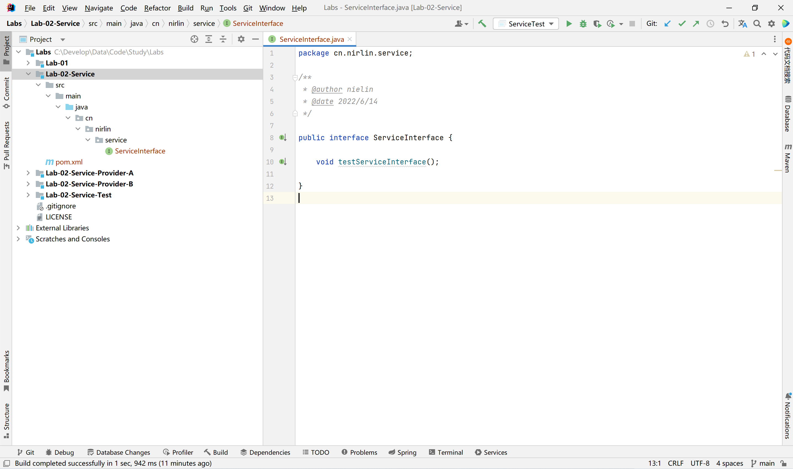
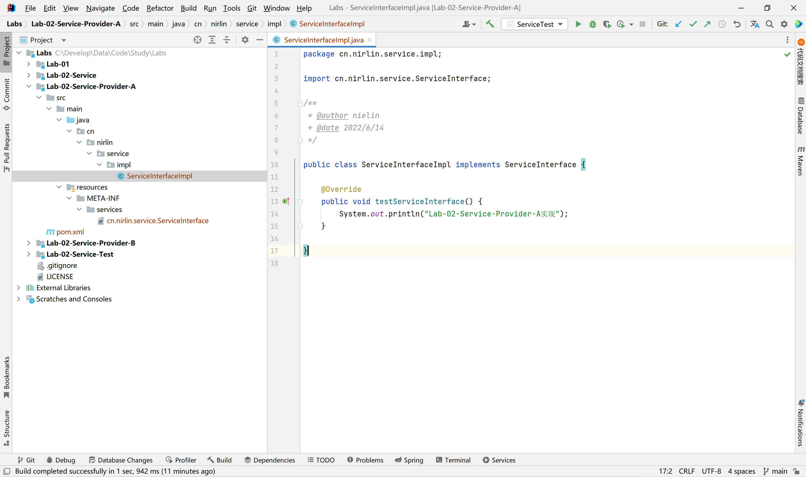
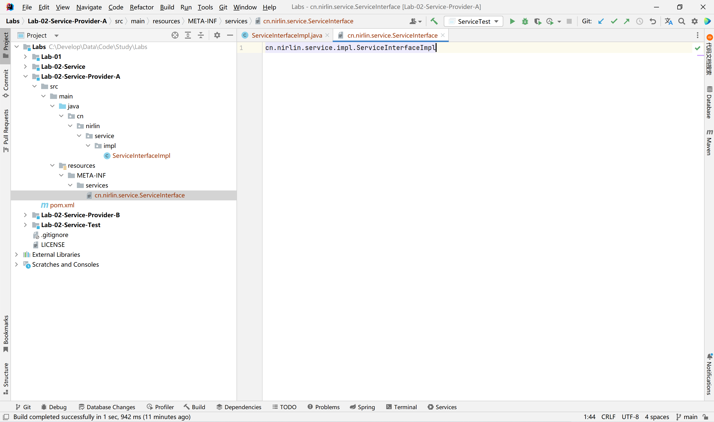
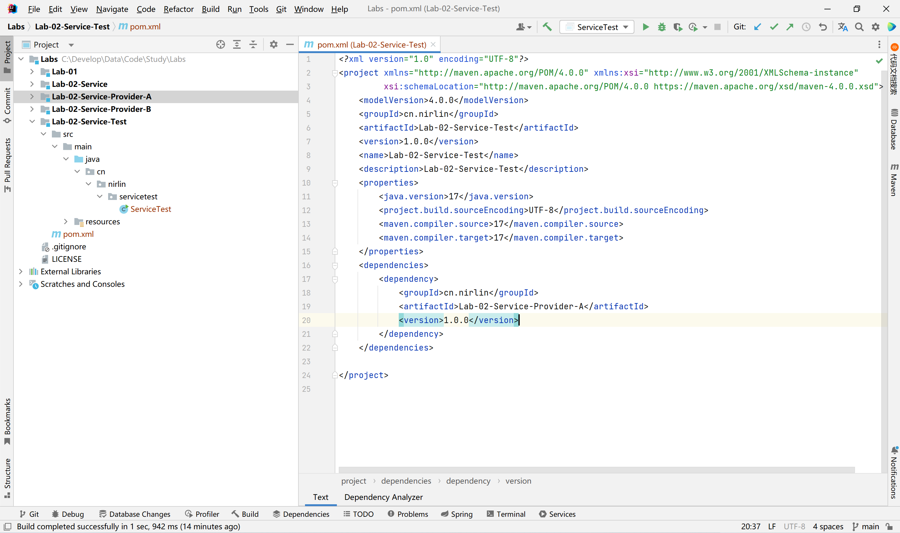
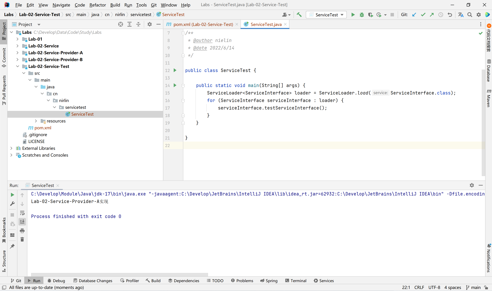
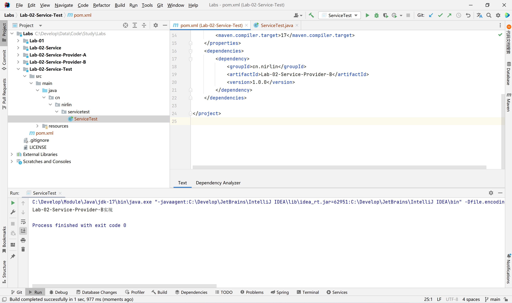

# 学习笔记-Java SPI

[TOC]

> 源码见：https://github.com/NIRLIN/Labs

# SPI基本原理

在面向对象的设计原则中，一般推荐模块之间基于接口编程，通常情况下调用方模块是不会感知到被调用方模块的内部具体实现。一旦代码里面涉及具体实现类，就违反了开闭原则。如果需要替换一种实现，就需要修改代码。

为了实现在模块装配的时候不用在程序里面动态指明，这就需要一种服务发现机制。Java SPI 就是提供了这样一个机制：为某个接口寻找服务实现的机制。这有点类似 IOC 的思想，将装配的控制权移交到了程序之外。

`SPI` 英文为 `Service Provider Interface` 字面意思就是：“服务提供者的接口”，我的理解是：专门提供给服务提供者或者扩展框架功能的开发者去使用的一个接口。

SPI 将服务接口和具体的服务实现分离开来，将服务调用方和服务实现者解耦，能够提升程序的扩展性、可维护性。修改或者替换服务实现并不需要修改调用方。

推荐教程：

https://zhuanlan.zhihu.com/p/436560515

https://www.bilibili.com/video/BV1RY4y1v7mN

# 代码实践

## Lab-02-Service

最上层进行接口定义

## Lab-02-Service-Provider-A

接口实现

根据规则定义实现接口

**services中文件名为接口全限定名，文件内容为实现类全限定名。**

## Lab-02-Service-Provider-B

Lab-02-Service-Provider-B与Lab-02-Service-Provider-A相似

## Lab-02-Service-Test

引入具体实现包

通过**ServiceLoader**加载具体实现

## 问题：同时导入两个实现包的情况下，仅能加载一个包的实现类

在排查时发现，最终是将全类名加载至Set，由于全类名重复导致其中一个实现类被覆盖。java.util.ServiceLoader.LazyClassPathLookupIterator#parseLine

