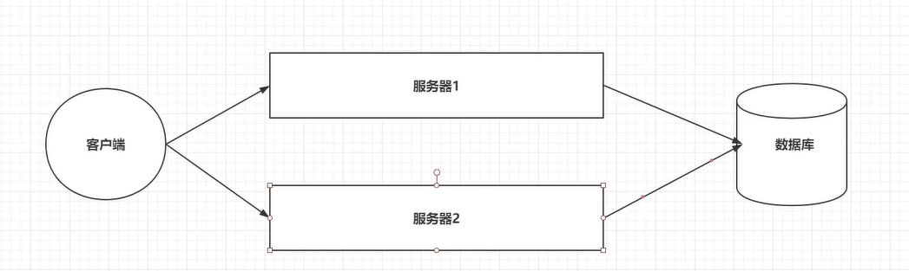
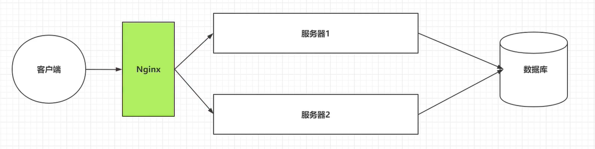
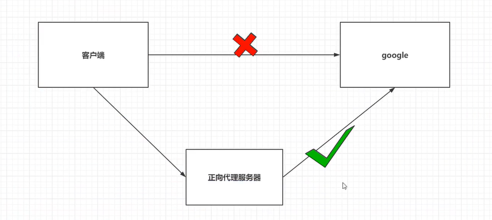
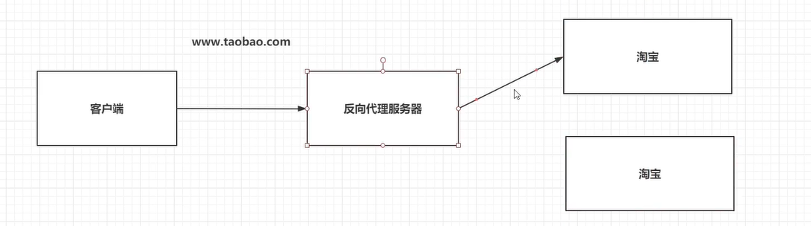
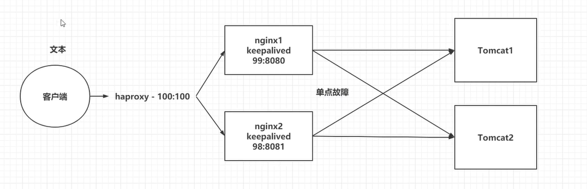

# Nginx学习笔记

[TOC]

# 1.简介

Nginx (engine x) 是一个高性能的HTTP和反向代理web服务器，同时也提供了IMAP/POP3/SMTP服务。

## 1.引言

> 为什么要学Nginx？
>
> 问题1：客户端到底要将请求发送给哪台服务器。
>
> 问题2：如果所有的客户端请求都发给了服务器1。
>
> 问题3：客户端发送的请求可能是申请静态资源的，也有申请动态资源的。

```
服务器搭建集群后
```





```
搭建集群后使用Nginx做反向代理服务器
```

## 2.Nginx介绍

Nginx是由伊戈尔·赛索耶夫为俄罗斯访问量第二的Rambler.ru站点（俄文：Рамблер）开发的，第一个公开版本0.1.0发布于2004年10月4日。
其将源代码以类BSD许可证的形式发布，因它的稳定性、丰富的功能集、示例配置文件和低系统资源的消耗而闻名。2011年6月1日，Nginx 1.0.4发布。
Nginx是一款轻量级的Web 服务器/反向代理服务器及电子邮件（IMAP/POP3）代理服务器，在BSD-like 协议下发行。其特点是占有内存少，并发能力强，事实上Nginx的并发能力在同类型的网页服务器中表现较好，中国大陆使用Nginx网站用户有：百度、京东、新浪、网易、腾讯、淘宝等。

```
Nginx特点
	1.稳定性极强。7*24小时不间断运行
	2.Nginx提供了非常丰富的配置实例。
	3.占用内存少，并发能力强。
	
```

# 2.Nginx安装

## 1.安装Nginx

1.安装

```
docker pull nginx
```

2.运行

```
docker run -d -p80:80 nginx
```

3.查看

```
docker ps
```

4.停止运行

```
docker stop imageid
```

5.编辑

```
1.docker exec -it imageid /bin/bash
2.docker exec -it imageid bash
```

## 2.Nginx的配置文件

> 关于Nginx的核心配置文件nginx.conf
>
> 位置：/etc/nginx/nginx.conf

```json

user  Nginx;
worker_processes  1;

error_log  /var/log/nginx/error.log warn;
pid        /var/run/nginx.pid;

# 以上统称为全局块。
# worker_processes的数值越大，Nginx的并发能力越强。
# error_log，代表Nginx的错误日志存放的位置

events {
    worker_connections  1024;
}

# events块
# worker_connections的数值越大，Nginx的并发能力越强。


http {
    include       /etc/nginx/mime.types;
    default_type  application/octet-stream;

    log_format  main  '$remote_addr - $remote_user [$time_local] "$request" '
                      '$status $body_bytes_sent "$http_referer" '
                      '"$http_user_agent" "$http_x_forwarded_for"';

    access_log  /var/log/nginx/access.log  main;

    sendfile        on;
    #tcp_nopush     on;

    keepalive_timeout  65;

    #gzip  on;

    include /etc/nginx/conf.d/*.conf; # 将会被以下替换
    server{
    
    }
}
# http块
# include,代表引入一个外部文件，mime.types中存放大量的媒体类型
# include /etc/nginx/conf.d/*.conf ，引入了conf.d目录下的以conf为结尾的配置文件。 
```

> default.conf

```json
server {
    listen       80;
    listen  [::]:80;
    server_name  localhost;

    location / {
        root   /usr/share/nginx/html;
        index  index.html index.htm;
        
    }
	# location块
	# root，将接收到的请求，根据这个路径去查找静态资源
	# index，默认去上述路径中查找index.html index.htm
}
# server 块
# listen，Nginx监听的端口号
# localhost，代表Nginx接收的ip
```

# 3.Nginx的反向代理

## 1.正向代理

> 1.正向代理服务是由客户端设立的
>
> 2.客户端了解代理服务器和目标服务器都是谁
>
> 3.帮助实现突破访问权限，提高访问速度，对目标服务器隐藏客户端ip地址。




## 2.反向代理

> 1.反向代理服务器是配置在服务端的。
>
> 2.客户端是不知道访问的到底是哪一台服务器。
>
> 3.达到负载均衡，并且可以隐藏服务器真正的ip地址




## 3.基于Nginx实现反向代理

1.启动tomcat并挂载

```
docker run -d  -v /home/tomcat/webapps/ROOT:/usr/local/tomcat/webapps/ROOT -p 8080:8080 tomcat
```

2.在/home/tomcat/webapps/ROOT下新建文件index.html

```
<h1>tomcat01</h1>
```

3.网页访问

4.Docker挂载Nginx

```
docker run -d  -v /home/nginx:/etc/nginx  -p 80:80 nginx
```

```
docker run -d -v /home/nginx/conf.d:/etc/nginx/conf.d  -p 80:80 nginx
```

5.编写default.conf

```json
server {
    listen       80;
    listen  [::]:80;
    server_name  localhost;
	# 基于反向代理访问到tomcat服务器
	location / {
        proxy_pass http://39.100.232.173:8080/;
    }

}
```

## 4.关于Nginx的location路径映射

> 优先级关系
>
> ( location =/ ) > ( location /xxx ) > ( location ^~ ) > 

```json
# 1. =匹配
location  = / {
 # 精准匹配主机名后面不可以带任何字符串
}
```

```json
# 2. 通用匹配
location /xxx{
    # 匹配所有的以/xxx开头的路径
}
```

```json
# 3. 正则匹配
location ~/xxx{
	# 匹配所有的以/xxx开头的路径
}
```

```json
# 4. 匹配开头路径
location ^~/images/{
	# 匹配所有的以/images开头的路径
}
```

```json
# 5. ~*\.(gif|png|jpg){
# 匹配以gif|png|jpg结尾路径

}
```


# 4. Nginx负载均衡

> Nginx为我们默认提供了三种负载均衡的策略
>
> ​	1.轮询
>
> ​		将客户端发起的请求，平均分配给每一台服务器
>
> ​	2.权重
>
> ​		将客户端请求根据权重值不同，分配不同数量
>
> ​	3.ip_hash
>
> ​		基于发起请求的客户端的ip地址不同，它始终会将请求发送到指定的服务器上

## 1.轮询

> 想实现Nginx轮询负载均衡机制只需要在配置文件中添加以下内容

```json
upstream 名字{
	server ip:port;
    server ip:port;
}
server {
    listen       80;
    listen  [::]:80;
    server_name  localhost;
	# 基于反向代理访问到tomcat服务器
	location / {
        proxy_pass http://upstream名字/;
    }
}
```

## 2.权重

> 实现权重

```json
upstream 名字{
	server ip:port weight=number;
    server ip:port weight=number;
}
server {
    listen       80;
    listen  [::]:80;
    server_name  localhost;
	# 基于反向代理访问到tomcat服务器
	location / {
        proxy_pass http://upstream名字/;
    }
}
```

## 3.ip_hash

> 实现ip_hash

```json
upstream 名字{
    ip_hash;
	server ip:port weight=number;
    server ip:port weight=number;
}
server {
    listen       80;
    listen  [::]:80;
    server_name  localhost;
	# 基于反向代理访问到tomcat服务器
	location / {
        proxy_pass http://upstream名字/;
    }
}
```

# 5.Nginx动静分离

> Nginx并发能力计算公式：
>
> worker_processes*worker_connections/4|2=Nginx最终的并发能力
>
> 动态资源/4，静态资源/2
>
> Nginx通过动静分离，来提升Nginx

## 1.动态资源代理

```
# 配置如下
location  / {
	proxy_pass 路径;
}
```

## 2.静态资源代理

```
# 配置如下
location  / {
	root 静态资源路径;
	index 默认访问路径下什么资源
	autoindex on; # 代表展示静态资源的全部内容，以列表方式展开
}
```

# 6.Nginx集群

## 1.引言

> 单点故障，避免Nginx的宕机导致整个程序的崩溃
>
> ​	1.准备多台Nginx
>
> ​	2.准备keepalived,监听Nginx的健康状况
>
> ​	3.准备haproxy，提供一个虚拟路径，统一接收用户请求



## 2.搭建Nginx集群

