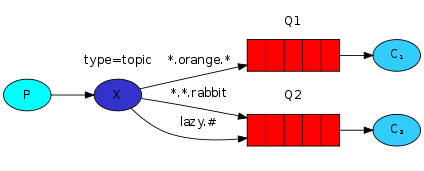

# RabbitMQ学习笔记

# 0.目录

[TOC]

# 1.引言

## 1.什么是MQ

MQ（Message Queue）消息队列，是基础数据结构中“先进先出”的一种数据结构。一般用来解决应用解耦，异步消息，流量削峰等问题，实现高性能，高可用，可伸缩和最终一致性架构。

通过典型的生产者和消费者模型生产者不断向消息队列中产生消息，消费者不断从队列中获取消息。因为消息的生产和消费都是异步的，而且只关心消息的发送和接收，没有业务逻辑的侵入，轻松地实现系统的解耦。

别名消息中间件，通过利用高效可靠的消息传递机制进行平台无关的数据交流，并基于数据通信来进行分布式系统的集成。

## 2.主要的MQ有哪些

主要的MQ产品包括：老牌的RabbitMQ、ActiveMQ，炙手可热的kafka，阿里巴巴的RocketMQ

## 3.不同MQ的特点

### 1.RabbitMQ

使用Erlang编写的一个开源的消息队列，本身支持很多的协议：AMQP，XMPP, SMTP,STOMP，也正是如此，使的它变的非常重量级，更适合于企业级的开发。同时实现了Broker架构，核心思想是生产者不会将消息直接发送给队列，消息在发送给客户端时先在中心队列排队。对路由(Routing)，负载均衡(Load balance)、数据持久化都有很好的支持。多用于进行企业级的ESB整合。

### 2.ActiveMQ

Apache下的一个子项目。使用Java完全支持JMS1.1和J2EE 1.4规范的 JMS Provider实现，少量代码就可以高效地实现高级应用场景。可插拔的传输协议支持，比如：in-VM, TCP, SSL, NIO, UDP, multicast, JGroups and JXTA transports。RabbitMQ、ZeroMQ、ActiveMQ均支持常用的多种语言客户端 C++、Java、.Net,、Python、 Php、 Ruby等。

### 3.Kafka

Apache下的一个子项目，使用scala实现的一个高性能分布式Publish/Subscribe消息队列系统，具有以下特性：

- 快速持久化：通过磁盘顺序读写与零拷贝机制，可以在O(1)的系统开销下进行消息持久化；
- 高吞吐：在一台普通的服务器上既可以达到10W/s的吞吐速率；
- 高堆积：支持topic下消费者较长时间离线，消息堆积量大；
- 完全的分布式系统：Broker、Producer、Consumer都原生自动支持分布式，依赖zookeeper自动实现复杂均衡；
- 支持Hadoop数据并行加载：对于像Hadoop的一样的日志数据和离线分析系统，但又要求实时处理的限制，这是一个可行的解决方案。

### 4.RocketMQ

阿里系下开源的一款分布式、队列模型的消息中间件，原名Metaq，3.0版本名称改为RocketMQ，是阿里参照kafka设计思想使用java实现的一套mq。同时将阿里系内部多款mq产品（Notify、metaq）进行整合，只维护核心功能，去除了所有其他运行时依赖，保证核心功能最简化，在此基础上配合阿里上述其他开源产品实现不同场景下mq的架构，目前主要多用于订单交易系统。

具有以下特点：

- 能够保证严格的消息顺序

- 提供针对消息的过滤功能

- 提供丰富的消息拉取模式

- 高效的订阅者水平扩展能力

- 实时的消息订阅机制

- 亿级消息堆积能力

  官方提供了一些不同于kafka的对比差异： 
  https://rocketmq.apache.org/docs/motivation/

### 5.Redis

使用C语言开发的一个Key-Value的NoSQL数据库，开发维护很活跃，虽然它是一个Key-Value数据库存储系统，但它本身支持MQ功能，所以完全可以当做一个轻量级的队列服务来使用。对于RabbitMQ和Redis的入队和出队操作，各执行100万次，每10万次记录一次执行时间。测试数据分为128Bytes、512Bytes、1K和10K四个不同大小的数据。实验表明：入队时，当数据比较小时Redis的性能要高于RabbitMQ，而如果数据大小超过了10K，Redis则慢的无法忍受；出队时，无论数据大小，Redis都表现出非常好的性能，而RabbitMQ的出队性能则远低于Redis。

## 4.RabbitMQ的AMQP

AMQP，即Advanced Message Queuing Protocol，一个提供统一消息服务的应用层标准高级消息队列协议，是应用层协议的一个开放标准，为面向消息的中间件设计。基于此协议的客户端与消息中间件可传递消息，并不受客户端/中间件不同产品，不同的开发语言等条件的限制。Erlang中的实现有RabbitMQ等。

## 5.为什么使用RabbitMQ

1.使用简单、功能强大。

2.基于AMQP协议

3.社区活跃、文档完善

4.高并发性能好，主要得益于Erlang语言

5.Spring Boot默认集成RabbitMQ


# 2.RabbitMQ快速入门

## 1.安装

1.下载

```
docker pull rabbitmq
```

2.启动

```
docker run -d --hostname my-rabbit --name rabbit -p 15672:15672 -p 5672:5672 rabbitmq
```

3.进入容器

```
docker exec -it 镜像ID /bin/bash
```

4.启动rabbitmq_management

```
rabbitmq-plugins enable rabbitmq_management
```

5.访问ip:15672

> 账号：guest
>
> 密码：guest


## 2.RabbitMQ工作原理


组成说明：

- Broker：消息队列服务进程，由两部分组成：Exchange和Queue
- Exchange：消息队列交换机，按一定的规则将消息路由转发到某个队列，对消息进行过滤。
- Queue：消息队列，存储消息的队列，消息到达队列，并转发给指定的消费方。
- Producer：消息生产者，即生产方客户端。生产方客户端将消息发送到MQ
- Consumer：消息消费者，即消费方客户端。接收MQ转发的消息

消息发布接收流程：

> 发送消息
>
> 1. 生产者和Broker建立TCP连接
> 2. 生产者和Broker建立通道
> 3. 生产者通过把消息发送到Broker，Exchange将消息进行转发
> 4. Exchange将消息转发到指定的Queue

> 接收消息
>
> 1. 消费者和Broker建立TCP连接
> 2. 消费者和Broker建立通道
> 3. 消费者监听指定的Queue
> 4. 当有消息到达Queue时Broker默认将消息推送给消费者
> 5. 消费者接收到消息


## 3.Hello Word

###  1.pom.xml

```xml
<dependencies>
    <dependency>
    <groupId>org.springframework.boot</groupId>
    <artifactId>spring-boot-starter-amqp</artifactId>
    </dependency>
    <dependency>
    <groupId>org.springframework.amqp</groupId>
    <artifactId>spring-rabbit-test</artifactId>
    <scope>test</scope>
    </dependency>
</dependencies>
```

### 2.Producer01.java

```java
public class Producer01 {
    /**
     * 队列
     */
    private static final String QUEUE="helloword";
    public static void main(String[] args) {
        //通过连接工厂创建新的连接和MQ简历连接
        ConnectionFactory connectionFactory=new ConnectionFactory();
        //设置ip:port
        connectionFactory.setHost("39.100.232.173");
        connectionFactory.setPort(5672);
        //设置账户，密码
        connectionFactory.setUsername("guest");
        connectionFactory.setPassword("guest");
        //设置虚拟机,一个MQ服务可以设置多个虚拟机，每个虚拟机相当于独立的MQ
        connectionFactory.setVirtualHost("/");
        Connection connection=null;
        Channel channel=null;
        try {
            //建立新连接
            connection = connectionFactory.newConnection();
            //创建新会话通道，生产者和MQ服务所有通信都在channel中完成
            channel = connection.createChannel();
            //声明队列,如果队列在MQ中没有，则创建
            //参数列表 String queue, boolean durable, boolean exclusive, boolean autoDelete, Map<String, Object> arguments
            //1. queue 队列名称
            //2. durable 是否持久化，如果持久化，MQ重启后队列还在
            //3. exclusive 是否排他，队列只允许在该连接中访问，如果连接关闭队列自动删除，如果此参数设置为true，可用于临时队列的创建
            //4. autoDelete自动删除
            //5. arguments 参数可以设置队列的扩展参数，如存活时间
            channel.queueDeclare(QUEUE,true,false,false,null);
            //参数列表String exchange, String routingKey, BasicProperties props, byte[] body
            //1. exchange ，交换机，如果不指定，将使用MQ默认交换机,设置为""
            //2. routingKey，路由key，交换机根据路由key来将消息转发到指定的队列，如果使用默认交换机，routingKey设置为队列名称
            //3. props 消息属性
            //4. body 消息内容
            String message="hello word rabbitmq";
            channel.basicPublish("",QUEUE,null,message.getBytes());

        } catch (IOException | TimeoutException e) {
            e.printStackTrace();
        }finally {
            try {
                if (channel != null) {
                    channel.close();
                }
            } catch (IOException | TimeoutException e) {
                e.printStackTrace();
            }
            try {
                if (connection != null) {
                    connection.close();
                }
            } catch (IOException e) {
                e.printStackTrace();
            }
        }
    }
}
```

### 3.Consumer01.java

```java
public class Consumer01 {
    /**
     * 队列
     */
    private static final String QUEUE="helloword";
    public static void main(String[] args) {
        //通过连接工厂创建新的连接和MQ简历连接
        ConnectionFactory connectionFactory=new ConnectionFactory();
        //设置ip:port
        connectionFactory.setHost("39.100.232.173");
        connectionFactory.setPort(5672);
        //设置账户，密码
        connectionFactory.setUsername("guest");
        connectionFactory.setPassword("guest");
        //设置虚拟机,一个MQ服务可以设置多个虚拟机，每个虚拟机相当于独立的MQ
        connectionFactory.setVirtualHost("/");
        Connection connection=null;
        try {
            //建立新连接
            connection = connectionFactory.newConnection();
            //创建新会话通道，生产者和MQ服务所有通信都在channel中完成
            Channel channel = connection.createChannel();
            //声明队列,如果队列在MQ中没有，则创建
            //参数列表 String queue, boolean durable, boolean exclusive, boolean autoDelete, Map<String, Object> arguments
            //1. queue 队列名称
            //2. durable 是否持久化，如果持久化，MQ重启后队列还在
            //3. exclusive 是否排他，队列只允许在该连接中访问，如果连接关闭队列自动删除，如果此参数设置为true，可用于临时队列的创建
            //4. autoDelete自动删除
            //5. arguments 参数可以设置队列的扩展参数，如存活时间
            channel.queueDeclare(QUEUE,true,false,false,null);

            //实现消费方法
            DefaultConsumer defaultConsumer=new DefaultConsumer(channel){
                /**
                 * 当接收到消息后，此方法将被调用
                 * @param consumerTag  消费者标签，标识消费者
                 * @param envelope 信封，
                 * @param properties 消息属性
                 * @param body 消息内容
                 * @throws IOException 异常
                 */
                @Override
                public void handleDelivery(String consumerTag, Envelope envelope, AMQP.BasicProperties properties, byte[] body) throws IOException {
                    //获得交换机
                    String exchange = envelope.getExchange();
                    // 消息id，MQ在channel中用来标识消息的id，用于确认消息已接收
                    long deliveryTag = envelope.getDeliveryTag();
                    String message= new String(body, StandardCharsets.UTF_8);
                    System.out.println("接收到："+message);
                }
            };
            //监听队列
            //String queue, boolean autoAck, com.rabbitmq.client.Consumer callback
            // 1.queue 队列名称
            // 2.autoAck 自动回复，当消费者接收到消息后，要告诉MQ消息已收到，如果此参数为true表示会自动回复MQ，反之则需要编程实现回复
            // 3.callback 消费方法，当消费者接收到消息要执行的方法
            channel.basicConsume(QUEUE,true,defaultConsumer);

        } catch (IOException | TimeoutException e) {
            e.printStackTrace();
        }
    }
}
```

# 3.工作模式

## 1.Hello World!

做某事 的最简单的事情


## 2.Work queues 工作队列

在工人之间分配任务（竞争的消费者模式）


- 一个生产者将消息发送给一个队列
- 多个消费者共同监听一个队列的消息
- 消息不能被重复消费
- rabbitmq采用轮询的方式将消息平均发送给消费者

测试：

 ​	启动多个消费者，一个生产者。消息将会使用轮询方式发送


## 3.Publish/Subscribe  发布/订阅

一次向许多消费者发送消息


发布/订阅模式：

- 一个生产者将消息发送给交换机加
- 与交换机绑定的有多个队列，每个消费者监听自己的队列
- 生产者将消息发送给交换机，由交换机将消息转发到绑定此交换机的每个队列，每个绑定此交换机的队列都将接收到消息
- 如果消息发送给没有绑定的交换机上消息将会丢失


Publish/Subscribe与Work queues有什么区别：

- Publish/Subscribe可以定义一个交换机绑定多个队列，一个消息可以发送给多个队列
- Work queues无需定义交换机，一个消息一次只能发送给一个队列
- Publish/Subscribe比Work queues功能更加强大，Publish/Subscribe也可以将多个消费者监听同一个队列实现Work queues的功能


测试：

用户通知，当用户充值成功或转账完成，系统通知用户，通知方式有短信邮件多种方法。

1.生产者

声明inform_Exchange_fanout交换机

声明两个队列并绑定到此交换机，绑定时不需要指定routingKey

发送消息时不需要指定routingKey

```java
public class Producer02Publish {
    private static final String QUERY_INFORM_EMAIL ="query_inform_email";
    private static final String QUERY_INFORM_SMS ="query_inform_sms";
    private static final String INFORM_EXCHANGE_FANOUT ="inform_Exchange_fanout";
    public static void main(String[] args) {
        ConnectionFactory connectionFactory=null;
        Connection connection=null;
        Channel channel=null;
        try {
            connectionFactory=new ConnectionFactory();
            connectionFactory.setHost("39.100.232.173");
            connectionFactory.setPort(5672);
            connectionFactory.setUsername("guest");
            connectionFactory.setPassword("guest");
            connectionFactory.setVirtualHost("/");
            connection=connectionFactory.newConnection();
            channel=connection.createChannel();
            channel.queueDeclare(QUERY_INFORM_EMAIL,true,false,false,null);
            channel.queueDeclare(QUERY_INFORM_SMS,true,false,false,null);
            //声明一个交换机
            channel.exchangeDeclare(INFORM_EXCHANGE_FANOUT, BuiltinExchangeType.FANOUT);
            //将交换机与队列进行绑定
            channel.queueBind(QUERY_INFORM_EMAIL,INFORM_EXCHANGE_FANOUT,"");
            channel.queueBind(QUERY_INFORM_SMS,INFORM_EXCHANGE_FANOUT,"");
//            channel.basicPublish(INFORM_EXCHANGE_FANOUT,"",null,"邮件1".getBytes());
//            channel.basicPublish(INFORM_EXCHANGE_FANOUT,"",null,"短信1".getBytes());
            channel.basicPublish("",QUERY_INFORM_EMAIL,null,"邮件1".getBytes());
            channel.basicPublish("",QUERY_INFORM_SMS,null,"短信1".getBytes());

        }catch (Exception e){
            e.printStackTrace();
        }
    }
}
```

2.消费者

```java
public class Consumer02SubscribeEmail {
    private static final String QUERY_INFORM_EMAIL = "query_inform_email";
    private static final String INFORM_EXCHANGE_FANOUT = "inform_Exchange_fanout";

    public static void main(String[] args) {
        ConnectionFactory connectionFactory = null;
        Connection connection = null;
        Channel channel = null;
        try {
            connectionFactory = new ConnectionFactory();
            connectionFactory.setHost("39.100.232.173");
            connectionFactory.setPort(5672);
            connectionFactory.setUsername("guest");
            connectionFactory.setPassword("guest");
            connectionFactory.setVirtualHost("/");
            connection = connectionFactory.newConnection();
            channel = connection.createChannel();
            channel.queueDeclare(QUERY_INFORM_EMAIL, true, false, false, null);
            //声明一个交换机
            channel.exchangeDeclare(INFORM_EXCHANGE_FANOUT, BuiltinExchangeType.FANOUT);
            //将交换机与队列进行绑定
            channel.queueBind(QUERY_INFORM_EMAIL, INFORM_EXCHANGE_FANOUT, "");
            //实现消费方法
            DefaultConsumer defaultConsumer = new DefaultConsumer(channel) {

                @Override
                public void handleDelivery(String consumerTag, Envelope envelope, AMQP.BasicProperties properties, byte[] body) throws IOException {
                    //获得交换机
                    String exchange = envelope.getExchange();
                    // 消息id，MQ在channel中用来标识消息的id，用于确认消息已接收
                    long deliveryTag = envelope.getDeliveryTag();
                    String message = new String(body, StandardCharsets.UTF_8);
                    System.out.println("接收到：" + message);
                }
            };
            channel.basicConsume(QUERY_INFORM_EMAIL, true, defaultConsumer);
        } catch (Exception e) {
            e.printStackTrace();
        }
    }
}
```


## 4.Routing 路由

有选择地接收消息


路由模式：

- 一个交换机绑定多个队列，每个对列设置routingKey，并且一个队列可以设置多个routingKey
- 每个消费者监听自己的队列
- 生产者将消息发送给交换机，发送消息时需指定routingKey的值，交换机来判断该routingKey的值和哪个队列的routingKey相等，如果相等则将消息转发给该队列


Routing 模式和Publish/Subscribe模式有什么区别：

- Publish/Subscribe模式在绑定交换机时不需要指定routingKey，消息会发送到每个绑定交换机的队列
- Routing模式要求队列在绑定交换机时要指定routingKey（这就是队列routingKey），发送消息将消息发送到和routingKey的值相等的队列中。如上图所示，每个队列可以指定多个routingKey，如果发送消息时指定routingKey为“error”，由于C1和C2的routingKey都是error，所以消息发送给了C1和C2
- 如果发送消息时指定routingKey为info，则只有C2才可以接收到消息

## 5.Topics 通配符

根据模式（主题）接收消息



通配符模式：

- 一个交换机可以绑定多个队列，每个队列可以设置一个或多个带通配符的routingKey
- 生产者将消息发送给交换机，交换机根据routingKey的值来匹配队列，匹配时采用通配符方式，匹配成功的将消息转发到指定的队列。


Topics与Routing的区别：

- Topics与Routing的原理基本相同，即：生产者将消息发给交换机，交换机根据routingKey将消息转发给与routingKey匹配的队列。
- 不同之处是routingKey的匹配方式，Topics模式是通配符匹配，Routing模式是相等匹配

> 符号#：匹配一个或多个词，比如infom.# 可以匹配infom.email、infom.sms、infom.sms.email
>
> 符号*：只能匹配一个词，比如infom.\*  可以匹配infom.email、infom.sms

## 6.RPC 远程过程调用

请求/回复模式示例


RPC即客户端远程调用服务端的方法，使用MQ可以实现RPC的异步调用，基于Direct交换机实现，流程如下：

1. 客户端既是生产者又是消费者，向RPC请求队列发送RPC调用消息，同时监听RPC响应队列
2. 服务端监听RPC请求队列的消息，收到消息后执行服务端的方法，得到方法返回的结果
3. 服务端将RPC方法的结果发送到RPC响应队列

## 7.交换机类型

1.fanout

工作模式是publish/subscribe 

2.direct

工作模式是routing

3.topic

工作模式是topic

4.headers

工作模式是headers