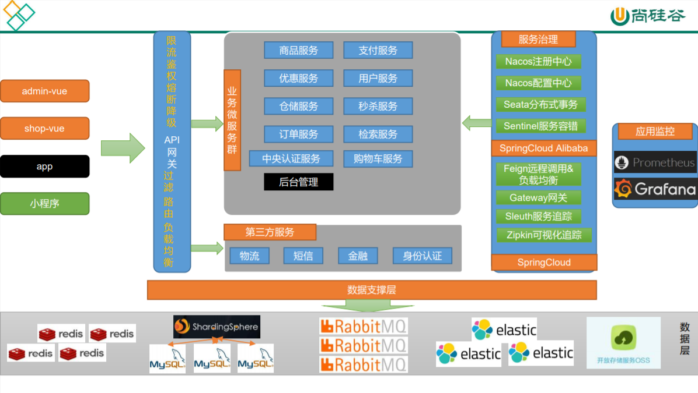

# 学习笔记-谷粒商城


# 0.目录

[TOC]

# 1.分布式基础（全栈开发篇）

## 1.系统架构图


## 2.微服务划分图



## 2.环境准备

### 1.Docker安装MySQL

```shell
docker run -d -p3306:3306 --name mysql5.7 -v /home/mysql5.7/log:/var/log/mysql -v /home/mysql5.7/data:/var/lib/mysql -v /home/mysql5.7/conf:/etc/mysql -e MYSQL_ROOT_PASSWORD=123456 mysql:5.7
```


### 2.Docker安装Redis

```
docker run -d -p6379:6379 --name redis -v /home/redis/data:/data  -v /home/redis/conf/redis.conf:/etc/redis/redis.conf redis redis-server /etc/redis/redis.conf
```

注：如果直接执行命令，/home/redis/conf/`redis.conf`将被视为目录，所以需预先创建 redis.conf文件。

使用docker exec -it redis redis-cli可连接redis

在redis.conf中输入“appendonly yes”，开启AOF方式的redis持久化。


# 2.分布式高级（微服务架构篇）

# 3.高可用集群（架构师提升篇）