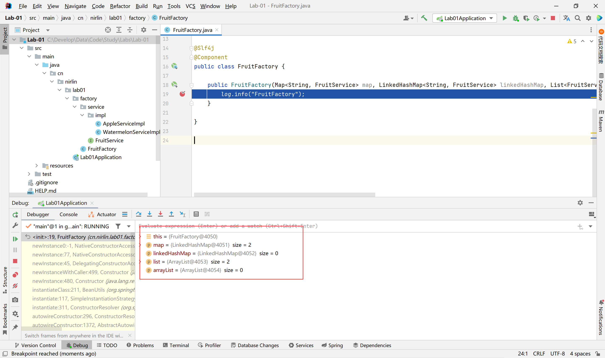
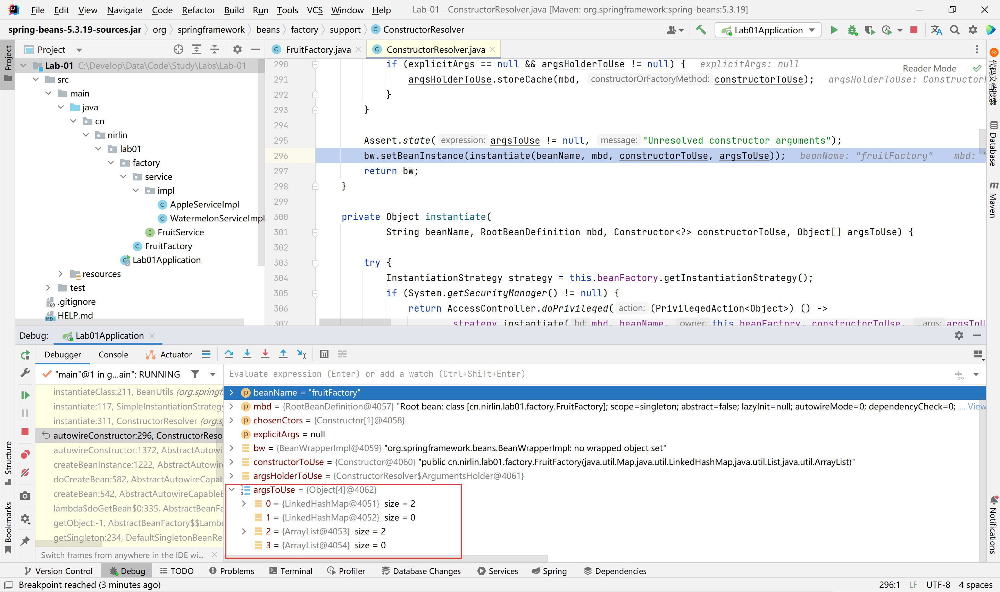
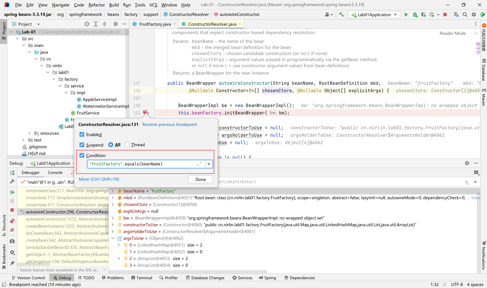
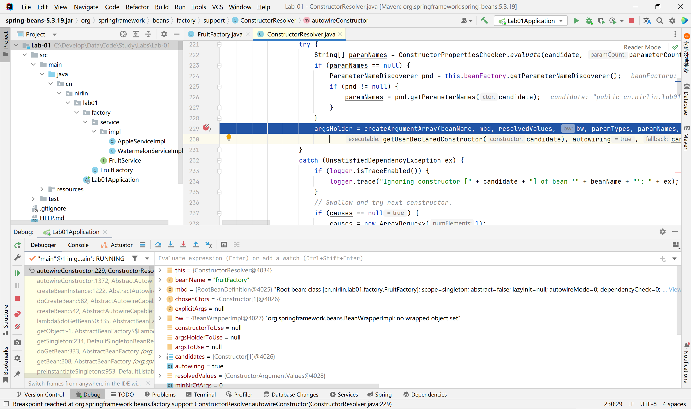
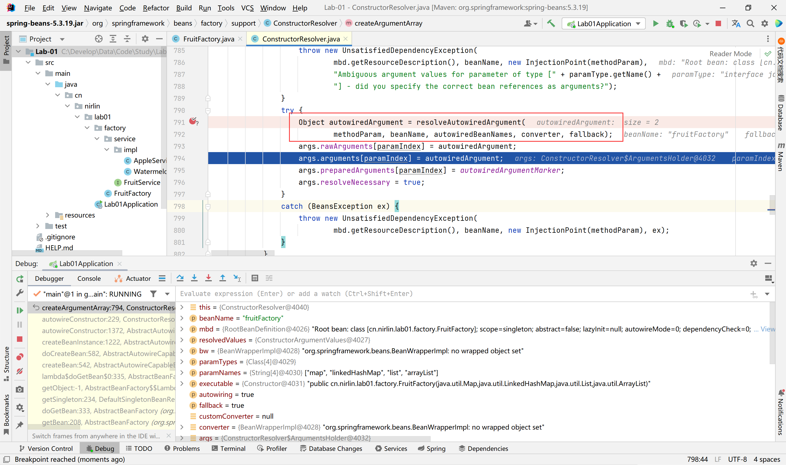
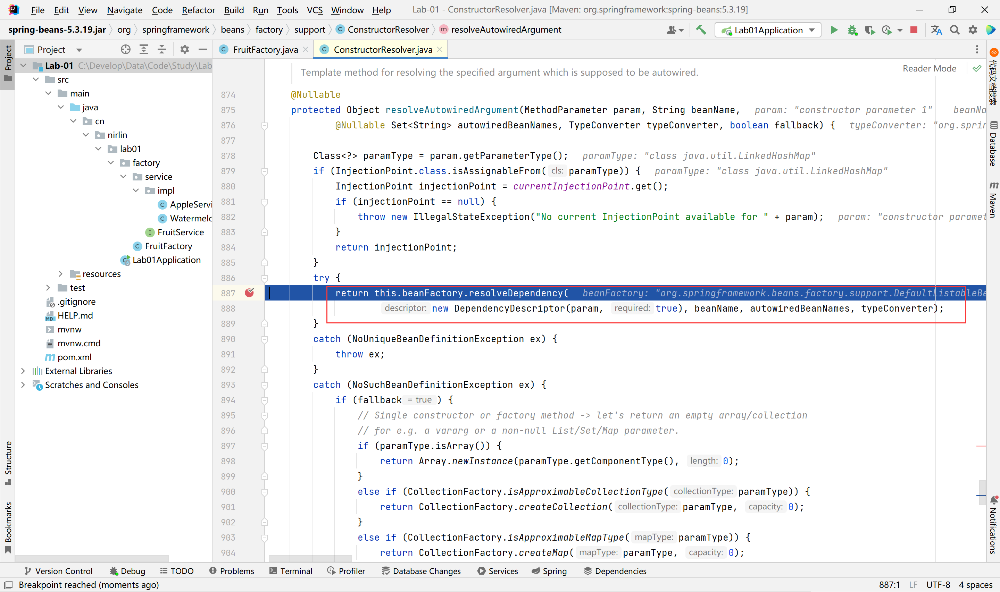
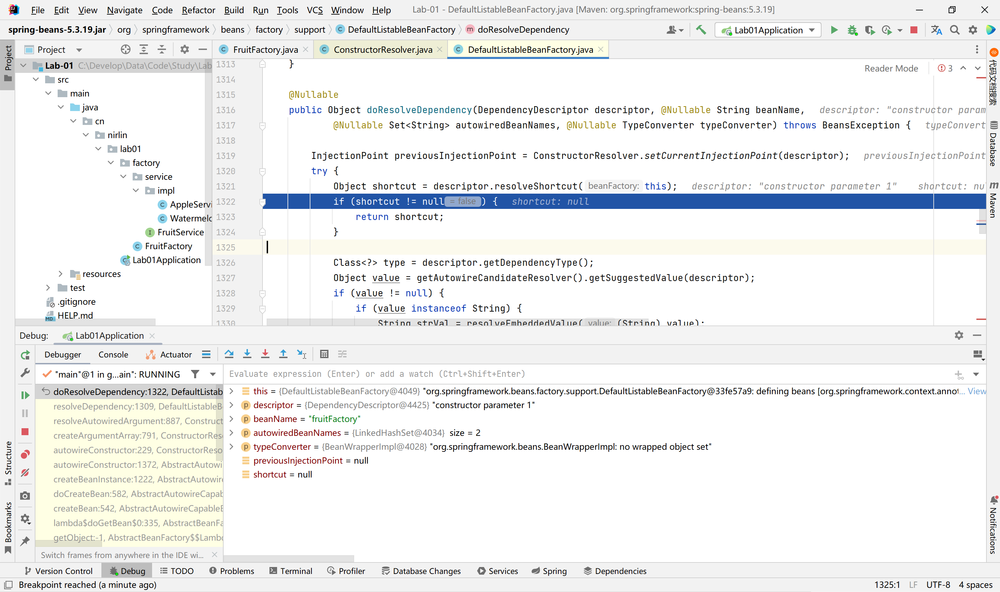
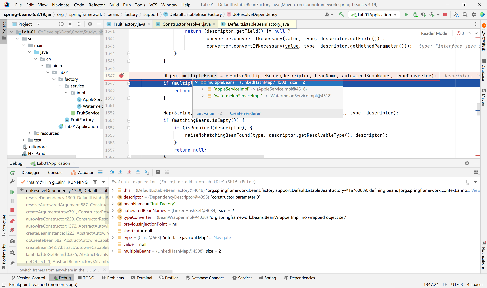
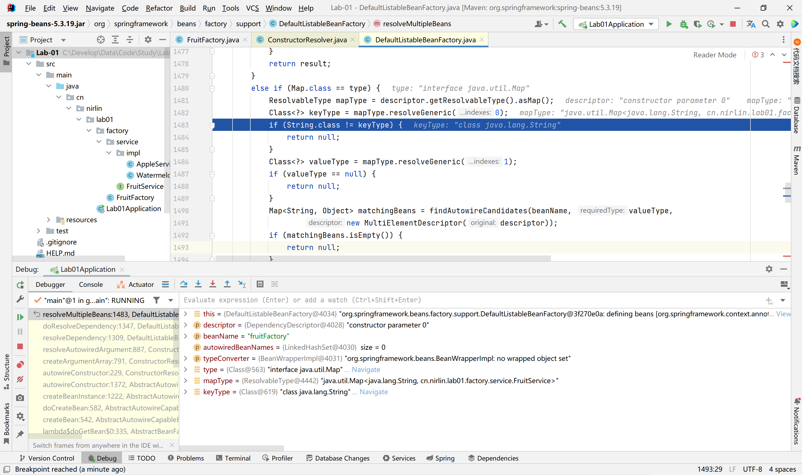
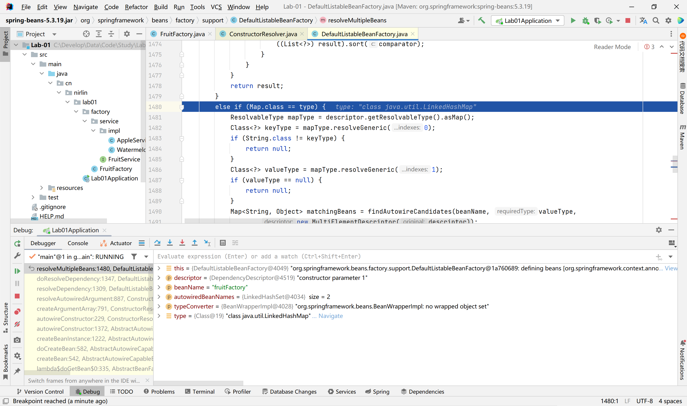

# 知识笔记-Spring装配Map、List原理

[TOC]

# 1、原因及问题

原因：

在使用策略模式时，会创建一个工厂类，以选择具体使用哪个类来进行业务处理。

问题：

使用构造器进行属性注入时，Map可以注入值，HashMap却无法注入。

使用构造器进行属性注入时，List可以注入值，ArrayList却无法注入。

# 2、项目搭建

> 项目地址：https://gitee.com/NIRLIN/Labs/tree/master/Lab-01

> 工厂类为水果类型，水果有多种种类，多种吃法
>
> 西瓜--切开吃
>
> 苹果--削皮、不削皮

项目创建使用：spring提供创建方法

```java
<parent>
    <groupId>org.springframework.boot</groupId>
    <artifactId>spring-boot-starter-parent</artifactId>
    <version>2.6.7</version>
    <relativePath/> <!-- lookup parent from repository -->
</parent>
   
<dependencies>
    <dependency>
    	<groupId>org.springframework.boot</groupId>
    	<artifactId>spring-boot-starter</artifactId>
    </dependency>
    <dependency>
    	<groupId>org.projectlombok</groupId>
   		<artifactId>lombok</artifactId>
    <optional>true</optional>
    </dependency>
 </dependencies>
```

工厂类：

```java
@Slf4j
@Component
public class FruitFactory {

    public FruitFactory(Map<String, FruitService> map, HashMap<String, FruitService> hashMap, List<FruitService> list, ArrayList<FruitService> arrayList) {
        log.info("map-->{}", map);
        log.info("hashMap-->{}", hashMap);
        log.info("list-->{}", list);
        log.info("arrayList-->{}", arrayList);
    }

}
```

水果接口：

```java
public interface FruitService {
    /**
     * 吃水果
     */
    void eatFruit();
}
```

苹果实现：

```java
@Slf4j
@Service
public class AppleServiceImpl implements FruitService {

    @Override
    public void eatFruit() {
        log.info("削皮或不削皮-->吃");
    }
}
```

西瓜实现：

```java
@Slf4j
@Service
public class WatermelonServiceImpl implements FruitService {

    @Override
    public void eatFruit() {
        log.info("切开-->吃");
    }
}
```

# 3、源码探寻

> 由此可看出map与list装配成功，但其实现类装配失败。



> 往堆栈上方寻找，由此可看出：
>
> 装配由ConstructorResolver.autowireConstructor(String beanName, RootBeanDefinition mbd,
> 			@Nullable Constructor<?>[] chosenCtors, @Nullable Object[] explicitArgs)完成。
>
> beanName="fruitFactory"，装填参数仅部分存在值



> 在ConstructorResolver.autowireConstructor中加入断点，判断值"fruitFactory".equals(beanName)



> 进行装配的值args，来自argsHolder.arguments。argsHolder.arguments来自，本类的createArgumentArray(
> 			String beanName, RootBeanDefinition mbd, @Nullable ConstructorArgumentValues resolvedValues,
> 			BeanWrapper bw, Class<?>[] paramTypes, @Nullable String[] paramNames, Executable executable,
> 			boolean autowiring, boolean fallback)方法。



> 在ConstructorResolver.createArgumentArray方法中resolveAutowiredArgument(MethodParameter param, String beanName,
> 			@Nullable Set<String> autowiredBeanNames, TypeConverter typeConverter, boolean fallback)对需要注入的参数进行注入



> 经由beanFactory.resolveDependency注入，使用DefaultListableBeanFactory进行实现



> 通过doResolveDependency(descriptor, requestingBeanName, autowiredBeanNames, typeConverter)进入



> 由resolveMultipleBeans进行属性填充



核心：

> org.springframework.beans.factory.support.DefaultListableBeanFactory#resolveMultipleBeans



	

由源码可看出，对于map类型，只对Map接口进行属性赋值，对其实现类不会进行赋值，对于list也是同理

```java
Map<String, Object> result = CollectionUtils.newLinkedHashMap(candidateNames.length);
```

对于map，spring装配时默认使用LinkedHashMap

# 4、总结

以上为大致内容，水平有限，敬请谅解，项目已上传至github。https://github.com/NIRLIN/Labs
